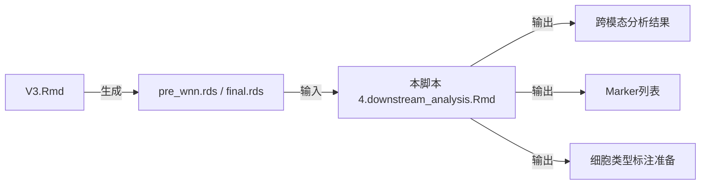

```{r setup, include=FALSE}
knitr::opts_chunk$set(
  echo = TRUE,
  warning = FALSE,
  message = FALSE,
  fig.width = 12,
  fig.height = 8,
  dpi = 300
)
```

# 脚本说明 {.tabset}

## 分析目标

本脚本是**脚本4的现代化重写版本**，专注于CITE-seq数据的深度分析：

### 🎯 核心分析内容

1. **基础QC可视化**（保留以确保数据质量）
   - UMI分布、线粒体百分比、基因数分布
   - 在降维空间中的展示

2. **双模态聚类对比**（基础展示）
   - RNA聚类 vs ADT聚类
   - 在各自降维空间中的展示

3. **🔥 跨模态可视化**（脚本4核心价值）
   - ADT聚类投影到RNA UMAP
   - RNA聚类投影到ADT UMAP
   - 评估两种模态的空间一致性

4. **🔥 跨模态Marker分析**（脚本4核心价值）
   - RNA markers → RNA clusters
   - ADT markers → ADT clusters
   - **RNA markers → ADT clusters** ← 关键！
   - **ADT markers → RNA clusters** ← 关键！

5. **🔥 单细胞高亮可视化**（脚本4特色）
   - 逐个cluster的细胞位置展示
   - 用于识别异常cluster

6. **细胞类型标注准备**
   - 导出marker列表（Excel格式）
   - 为手动标注提供数据基础

## 与V3的关系



**关键区别**：
- V3负责：数据加载、QC、降维、聚类、WNN整合
- 本脚本负责：**跨模态分析**、细胞类型标注、发表图准备

**冗余度**：约30%（基础QC和可视化）
**独特价值**：约70%（跨模态分析是本脚本的核心）

## 文献对应

本脚本复现了文献的以下分析：

- **Figure 1a**: 细胞类型标注的UMAP图
- **Supplementary Data**: Marker基因列表
- **方法学**: 跨模态验证策略

## 输入输出

### 📂 输入文件

```
results/Robjects/
├── GSE228544_{mode}_pre_wnn.rds     ← 优先使用（WNN前的对象）
└── GSE228544_{mode}_final.rds       ← 备选（包含WNN的对象）
```

### 📁 输出结构

```
downstream_results/
├── {mode}/
│   ├── Plots/
│   │   ├── QC/                    ← QC可视化
│   │   ├── Clustering/            ← 聚类对比
│   │   ├── CrossModal/            ← 🔥 跨模态分析
│   │   └── CellHighlight/         ← 单细胞高亮
│   ├── Robjects/
│   │   ├── markers_*.rds          ← Marker分析结果
│   │   └── annotated_obj.rds      ← 标注后的对象
│   └── Tables/
│       ├── RNA_markers_for_RNA_clusters.xlsx
│       ├── ADT_markers_for_ADT_clusters.xlsx
│       ├── RNA_markers_for_ADT_clusters.xlsx  ← 🔥 关键
│       └── ADT_markers_for_RNA_clusters.xlsx  ← 🔥 关键
```

## 使用方法

### RStudio 运行（推荐）

1. 打开 `4.downstream_analysis.Rmd`
2. 修改 Section 1.1 的 `analysis_mode` 参数
3. 点击 **Knit** 生成HTML报告

### 命令行运行

```bash
Rscript -e "rmarkdown::render('4.downstream_analysis.Rmd')"
```

---

# 配置与加载

## 分析模式配置

```{r analysis_mode}
################################################################################
########################## 🎯 分析模式设置 ######################################
################################################################################

# ==================== 选择分析模式 ====================
# 可选: "cDC1", "cDC2", "integrated", "full"
analysis_mode <- "integrated"  # 👈 在这里修改

# 验证
valid_modes <- c("cDC1", "cDC2", "integrated", "full")
if (!analysis_mode %in% valid_modes) {
  stop("❌ 无效的分析模式: ", analysis_mode,
       "\n   可选: ", paste(valid_modes, collapse = ", "))
}

cat("\n", strrep("=", 80), "\n")
cat("🎯 CITE-seq 下游分析\n")
cat("   分析模式:", analysis_mode, "\n")
cat(strrep("=", 80), "\n\n")
```

## 路径配置

```{r path_config}
################################################################################
########################## 📁 路径配置 ##########################################
################################################################################
#
# 重要说明：
# 1. .Rmd 文件的工作目录是文件所在目录
# 2. 使用相对路径确保可移植性
# 3. 所有路径在此集中配置，便于维护
#
################################################################################

# ==================== 显示当前工作目录 ====================
cat("📍 当前工作目录:", getwd(), "\n\n")

# ==================== 输入路径配置 ====================
# V3.Rmd 的输出目录（相对于当前.Rmd文件）
v3_output_dir <- "results/"
v3_robjects_dir <- file.path(v3_output_dir, "Robjects")

# 项目名称
project_name <- paste0("GSE228544_", analysis_mode)

# 输入文件（优先级：pre_wnn > final）
input_file_prewnn <- file.path(v3_robjects_dir, paste0(project_name, "_pre_wnn.rds"))
input_file_final <- file.path(v3_robjects_dir, paste0(project_name, "_final.rds"))

cat("📂 V3 输出目录:", v3_output_dir, "\n")
cat("📂 V3 Robjects:", v3_robjects_dir, "\n\n")

# ==================== 输出路径配置 ====================
# 本脚本的独立输出目录
output_base <- "downstream_results"
output_dir <- file.path(output_base, analysis_mode)

# 创建输出子目录
dir.create(output_dir, showWarnings = FALSE, recursive = TRUE)
dir.create(file.path(output_dir, "Plots"), showWarnings = FALSE, recursive = TRUE)
dir.create(file.path(output_dir, "Plots", "QC"), showWarnings = FALSE, recursive = TRUE)
dir.create(file.path(output_dir, "Plots", "Clustering"), showWarnings = FALSE, recursive = TRUE)
dir.create(file.path(output_dir, "Plots", "CrossModal"), showWarnings = FALSE, recursive = TRUE)
dir.create(file.path(output_dir, "Plots", "CellHighlight"), showWarnings = FALSE, recursive = TRUE)
dir.create(file.path(output_dir, "Robjects"), showWarnings = FALSE, recursive = TRUE)
dir.create(file.path(output_dir, "Tables"), showWarnings = FALSE, recursive = TRUE)

cat("📁 输出目录结构:\n")
cat("  根目录:", output_dir, "\n")
cat("  └─ Plots/\n")
cat("     ├─ QC/\n")
cat("     ├─ Clustering/\n")
cat("     ├─ CrossModal/\n")
cat("     └─ CellHighlight/\n")
cat("  └─ Robjects/\n")
cat("  └─ Tables/\n\n")

# ==================== 验证输入文件 ====================
cat("🔍 检查输入文件...\n")
if (file.exists(input_file_prewnn)) {
  input_file <- input_file_prewnn
  cat("  ✅ 找到 pre_wnn.rds:", input_file, "\n")
} else if (file.exists(input_file_final)) {
  input_file <- input_file_final
  cat("  ⚠️  未找到 pre_wnn.rds，使用 final.rds:", input_file, "\n")
} else {
  stop("❌ 找不到输入文件:\n",
       "   尝试1: ", input_file_prewnn, "\n",
       "   尝试2: ", input_file_final, "\n",
       "   请先运行 CITE-seq_Complete_Analysis_v3.Rmd")
}

file_size_mb <- round(file.size(input_file) / 1024 / 1024, 2)
cat("  文件大小:", file_size_mb, "MB\n\n")
```

## 加载R包

```{r load_packages}
cat("📦 加载 R 包...\n")

suppressPackageStartupMessages({
  library(Seurat)
  library(tidyverse)
  library(ggplot2)
  library(patchwork)
  library(RColorBrewer)
  library(gridExtra)
  library(openxlsx)
  library(knitr)
  library(kableExtra)
})

cat("✅ R 包加载完成\n\n")
```

## 工具函数

```{r utility_functions}
################################################################################
########################## 🛠️ 工具函数 #########################################
################################################################################

#' 绘图并自动保存（PNG + PDF）
#'
#' @param plot ggplot对象
#' @param filename 文件名（不含扩展名）
#' @param subfolder 子文件夹（相对于output_dir/Plots/）
#' @param width 宽度（英寸）
#' @param height 高度（英寸）
#' @param dpi PNG分辨率
plot_and_save <- function(plot, filename, subfolder = "",
                          width = 10, height = 8, dpi = 300) {

  # 构建完整路径
  if (subfolder != "") {
    plot_dir <- file.path(output_dir, "Plots", subfolder)
  } else {
    plot_dir <- file.path(output_dir, "Plots")
  }

  # 确保目录存在
  dir.create(plot_dir, showWarnings = FALSE, recursive = TRUE)

  # 保存PNG
  png_path <- file.path(plot_dir, paste0(filename, ".png"))
  ggsave(png_path, plot, width = width, height = height, dpi = dpi, bg = "white")

  # 保存PDF
  pdf_path <- file.path(plot_dir, paste0(filename, ".pdf"))
  ggsave(pdf_path, plot, width = width, height = height, device = "pdf")

  # 显示图形
  print(plot)

  invisible(list(png = png_path, pdf = pdf_path))
}

#' 单细胞高亮显示
#'
#' @param metadata Seurat对象的meta.data
#' @param coords 坐标数据框（包含UMAP/tSNE坐标）
#' @param cells_highlight 要高亮的细胞ID
#' @param coord_x X轴列名
#' @param coord_y Y轴列名
colorSomeCells <- function(metadata, coords, cells_highlight,
                          coord_x = "UMAP_1", coord_y = "UMAP_2") {

  # 创建颜色向量
  metadata$highlight <- ifelse(rownames(metadata) %in% cells_highlight, "Highlighted", "Other")

  # 合并坐标
  plot_data <- cbind(coords, metadata[rownames(coords), , drop = FALSE])

  # 绘图
  p <- ggplot(plot_data, aes_string(x = coord_x, y = coord_y)) +
    geom_point(aes(color = highlight), size = 0.5, alpha = 0.6) +
    scale_color_manual(values = c("Highlighted" = "#E41A1C", "Other" = "grey80")) +
    theme_classic() +
    theme(
      legend.position = "right",
      plot.title = element_text(hjust = 0.5, size = 14, face = "bold")
    )

  return(p)
}

cat("✅ 工具函数加载完成\n\n")
```

---

# 加载数据

```{r load_data}
################################################################################
########################## 📂 加载 Seurat 对象 ##################################
################################################################################

cat("📂 加载数据:", basename(input_file), "\n")
seurat_obj <- readRDS(input_file)

cat("✅ 数据加载完成\n\n")

# ==================== 数据概览 ====================
cat("📊 数据概览:\n")
cat("  细胞数:", ncol(seurat_obj), "\n")
cat("  基因数:", nrow(seurat_obj[["RNA"]]), "\n")
cat("  ADT数:", nrow(seurat_obj[["ADT"]]), "\n\n")

# ==================== 检查必需组件 ====================
cat("🔍 检查数据组件:\n")

# Assays
assays_available <- names(seurat_obj@assays)
cat("  Assays:", paste(assays_available, collapse = ", "), "\n")

# Reductions
reductions_available <- names(seurat_obj@reductions)
cat("  降维:", paste(reductions_available, collapse = ", "), "\n")

# Metadata
required_meta <- c("nCount_RNA", "nFeature_RNA", "subsets_Mito_percent",
                   "SCT_clusters", "ADT_clusters")
meta_available <- required_meta[required_meta %in% colnames(seurat_obj@meta.data)]
cat("  Metadata:", paste(meta_available, collapse = ", "), "\n")

# 聚类信息
if ("SCT_clusters" %in% colnames(seurat_obj@meta.data)) {
  n_sct <- length(unique(seurat_obj$SCT_clusters))
  cat("  RNA聚类数:", n_sct, "\n")
}
if ("ADT_clusters" %in% colnames(seurat_obj@meta.data)) {
  n_adt <- length(unique(seurat_obj$ADT_clusters))
  cat("  ADT聚类数:", n_adt, "\n")
}

cat("\n")
```

---

# QC可视化（基础保留）

## UMI分布

```{r qc_umi, fig.width=16, fig.height=7}
################################################################################
########################## QC: UMI 分布 #########################################
################################################################################

cat("📊 生成 UMI 分布图...\n")

# 准备数据
metadata <- seurat_obj@meta.data

# 在UMAP上显示UMI
if ("umap" %in% reductions_available) {
  umap_coords <- as.data.frame(seurat_obj[["umap"]]@cell.embeddings)
  colnames(umap_coords) <- c("UMAP_1", "UMAP_2")

  plot_data <- cbind(umap_coords, metadata[rownames(umap_coords), ])

  p_umi_umap <- ggplot(plot_data, aes(x = UMAP_1, y = UMAP_2, color = nCount_RNA)) +
    geom_point(size = 0.5, alpha = 0.6) +
    scale_color_gradientn(colours = c("darkblue", "cyan", "green", "yellow", "orange", "darkred"),
                         name = "UMI Count") +
    labs(title = "UMI Distribution on RNA UMAP",
         subtitle = paste0("Total cells: ", ncol(seurat_obj))) +
    theme_classic() +
    theme(plot.title = element_text(hjust = 0.5, face = "bold"))

  plot_and_save(p_umi_umap, "QC_UMI_distribution_umap", "QC", width = 10, height = 8)
}

# Violin plot
p_umi_violin <- VlnPlot(seurat_obj, features = "nCount_RNA", group.by = "SCT_clusters",
                        pt.size = 0) +
  labs(title = "UMI Count per Cluster", x = "Cluster", y = "UMI Count") +
  theme(axis.text.x = element_text(angle = 0))

plot_and_save(p_umi_violin, "QC_UMI_violin", "QC", width = 14, height = 6)

cat("✓ UMI分布图已保存\n\n")
```

## 线粒体百分比

```{r qc_mito, fig.width=16, fig.height=7}
cat("📊 生成线粒体百分比分布图...\n")

# 在UMAP上显示线粒体百分比
if ("umap" %in% reductions_available && "subsets_Mito_percent" %in% colnames(metadata)) {

  p_mito_umap <- ggplot(plot_data, aes(x = UMAP_1, y = UMAP_2, color = subsets_Mito_percent)) +
    geom_point(size = 0.5, alpha = 0.6) +
    scale_color_gradientn(colours = c("darkblue", "cyan", "green", "yellow", "orange", "darkred"),
                         name = "Mito %") +
    labs(title = "Mitochondrial Percentage on RNA UMAP",
         subtitle = "Quality control metric") +
    theme_classic() +
    theme(plot.title = element_text(hjust = 0.5, face = "bold"))

  plot_and_save(p_mito_umap, "QC_mito_distribution_umap", "QC", width = 10, height = 8)
}

# Violin plot
if ("subsets_Mito_percent" %in% colnames(metadata)) {
  p_mito_violin <- VlnPlot(seurat_obj, features = "subsets_Mito_percent",
                           group.by = "SCT_clusters", pt.size = 0) +
    labs(title = "Mitochondrial Percentage per Cluster",
         x = "Cluster", y = "Mito %") +
    theme(axis.text.x = element_text(angle = 0))

  plot_and_save(p_mito_violin, "QC_mito_violin", "QC", width = 14, height = 6)
}

cat("✓ 线粒体分布图已保存\n\n")
```

## 基因数分布

```{r qc_genes, fig.width=16, fig.height=7}
cat("📊 生成基因数分布图...\n")

# Violin plot
p_genes_violin <- VlnPlot(seurat_obj, features = "nFeature_RNA",
                          group.by = "SCT_clusters", pt.size = 0) +
  labs(title = "Gene Count per Cluster", x = "Cluster", y = "Gene Count") +
  theme(axis.text.x = element_text(angle = 0))

plot_and_save(p_genes_violin, "QC_genes_violin", "QC", width = 14, height = 6)

cat("✓ 基因数分布图已保存\n\n")
```

---

# 基础聚类可视化（保留）

## RNA聚类

```{r clustering_rna, fig.width=16, fig.height=7}
cat("📊 生成 RNA 聚类可视化...\n")

# UMAP
if ("umap" %in% reductions_available) {
  p_rna_umap <- DimPlot(seurat_obj, reduction = "umap", group.by = "SCT_clusters",
                        label = TRUE, repel = TRUE, label.size = 5) +
    labs(title = "RNA (SCT) Clusters on RNA UMAP",
         subtitle = paste0(length(unique(seurat_obj$SCT_clusters)), " clusters")) +
    theme(plot.title = element_text(hjust = 0.5, face = "bold"))

  plot_and_save(p_rna_umap, "clustering_RNA_umap", "Clustering", width = 10, height = 8)
}

# tSNE
if ("tsne" %in% reductions_available) {
  p_rna_tsne <- DimPlot(seurat_obj, reduction = "tsne", group.by = "SCT_clusters",
                        label = TRUE, repel = TRUE, label.size = 5) +
    labs(title = "RNA (SCT) Clusters on RNA tSNE",
         subtitle = paste0(length(unique(seurat_obj$SCT_clusters)), " clusters")) +
    theme(plot.title = element_text(hjust = 0.5, face = "bold"))

  plot_and_save(p_rna_tsne, "clustering_RNA_tsne", "Clustering", width = 10, height = 8)
}

cat("✓ RNA聚类图已保存\n\n")
```

## ADT聚类

```{r clustering_adt, fig.width=16, fig.height=7}
cat("📊 生成 ADT 聚类可视化...\n")

# UMAP
if ("adt_umap" %in% reductions_available) {
  p_adt_umap <- DimPlot(seurat_obj, reduction = "adt_umap", group.by = "ADT_clusters",
                        label = TRUE, repel = TRUE, label.size = 5) +
    labs(title = "ADT (Protein) Clusters on ADT UMAP",
         subtitle = paste0(length(unique(seurat_obj$ADT_clusters)), " clusters")) +
    theme(plot.title = element_text(hjust = 0.5, face = "bold"))

  plot_and_save(p_adt_umap, "clustering_ADT_umap", "Clustering", width = 10, height = 8)
}

# tSNE
if ("adt_tsne" %in% reductions_available) {
  p_adt_tsne <- DimPlot(seurat_obj, reduction = "adt_tsne", group.by = "ADT_clusters",
                        label = TRUE, repel = TRUE, label.size = 5) +
    labs(title = "ADT (Protein) Clusters on ADT tSNE",
         subtitle = paste0(length(unique(seurat_obj$ADT_clusters)), " clusters")) +
    theme(plot.title = element_text(hjust = 0.5, face = "bold"))

  plot_and_save(p_adt_tsne, "clustering_ADT_tsne", "Clustering", width = 10, height = 8)
}

cat("✓ ADT聚类图已保存\n\n")
```

---

# 🔥 跨模态分析解读指南 {.tabset}

## 什么是跨模态分析

### 📚 基本概念

**CITE-seq = RNA + Protein（ADT）**

在CITE-seq实验中，我们同时测量了：
- **RNA（转录组）**：细胞表达的mRNA
- **Protein（蛋白质组）**：细胞表面的蛋白质标记（通过抗体标记）

### 🎯 两种聚类策略

我们可以用两种方式对细胞进行聚类：

1. **RNA-driven clustering（RNA聚类）**
   - 基于基因表达相似性
   - 反映**转录状态**
   - 分辨率高，能捕捉细微的转录差异

2. **ADT-driven clustering（ADT聚类）**
   - 基于蛋白表达相似性
   - 反映**蛋白表型**
   - 更稳定，受技术噪音影响小

### ❓ 核心问题

**这两种聚类方法会给出相同的结果吗？**

- 如果**一致**：说明蛋白和RNA高度相关，细胞类型定义清晰
- 如果**不一致**：说明存在转录-蛋白解偶联，可能揭示新的生物学机制

## 为什么要跨模态分析

### 🔬 科学意义

#### 1. **验证聚类的稳健性**
- 如果RNA和ADT聚类高度一致 → 细胞类型定义可靠
- 如果不一致 → 需要深入探究原因

#### 2. **发现转录-蛋白解偶联**
```
RNA高表达 ≠ 蛋白高表达

可能原因：
- 转录后调控
- 蛋白降解
- 蛋白转运
- 翻译效率差异
```

#### 3. **互补的生物学信息**
- **RNA markers**：告诉我们细胞在"做什么"（转录程序）
- **Protein markers**：告诉我们细胞"是什么"（表型特征）

### 📊 具体例子

假设我们发现：

**情况1：高度一致**
```
ADT cluster 2 的细胞：
- 在RNA UMAP上也聚在一起
- RNA markers: Ccr7高表达
- ADT markers: CD86高表达
→ 解读：成熟DC，转录-蛋白一致
```

**情况2：部分一致**
```
ADT cluster 3 的细胞：
- 在RNA UMAP上分散在2个位置
- RNA markers: 一部分高表达Irf8，一部分高表达Irf4
- ADT markers: 都高表达CD11c
→ 解读：蛋白表型相同（都是DC），但转录状态不同（cDC1 vs cDC2）
```

**情况3：完全不一致**
```
RNA cluster 5 的细胞：
- 在ADT UMAP上分散在多个位置
- RNA markers: 增殖相关基因（Mki67, Pcna）
- ADT markers: 无明显特异性
→ 解读：处于增殖状态的不同细胞类型，RNA特征统一但蛋白异质
```

## 如何解读结果

### 📈 第一步：看空间投影

#### 查看这些图：
- `crossmodal_ADT_on_RNA_umap.png`
- `crossmodal_RNA_on_ADT_umap.png`
- `crossmodal_quad_comparison.png` ← **最重要**

#### 判断标准：

**🟢 完美一致**
```
ADT clusters 在 RNA UMAP 上：
- 每个ADT cluster占据独立区域
- 边界清晰，无重叠
→ 解读：两种模态高度一致，细胞类型定义可靠
```

**🟡 部分一致**
```
ADT clusters 在 RNA UMAP 上：
- 大部分cluster有独立区域
- 某些cluster有部分重叠
→ 解读：主要细胞类型一致，某些亚群有差异
```

**🔴 完全不一致**
```
ADT clusters 在 RNA UMAP 上：
- 同一个ADT cluster分散在多个区域
- 不同ADT cluster高度重叠
→ 解读：RNA和蛋白捕捉到不同的细胞异质性
```

### 📊 第二步：看Marker基因

#### 查看这些表格：
1. `RNA_markers_for_RNA_clusters.xlsx` - 基线
2. `ADT_markers_for_ADT_clusters.xlsx` - 基线
3. **🔥 `RNA_markers_for_ADT_clusters.xlsx`** - 关键！
4. **🔥 `ADT_markers_for_RNA_clusters.xlsx`** - 关键！

#### 分析逻辑：

**步骤1：理解ADT聚类的生物学身份**
```excel
打开：RNA_markers_for_ADT_clusters.xlsx

查看 ADT cluster 2 的 top markers：
- Ccr7      (高)  → 迁移型DC
- Fscn1     (高)  → 成熟DC
- Il12b     (高)  → Th1极化能力
- Relb      (高)  → 成熟标志

解读：ADT cluster 2 = 迁移型成熟DC（Migratory cDC）
```

**步骤2：理解RNA聚类的蛋白表型**
```excel
打开：ADT_markers_for_RNA_clusters.xlsx

查看 RNA cluster 5 的 top markers：
- CD86      (高)  → 共刺激分子
- MHCII     (高)  → 抗原提呈
- CD40      (高)  → 活化标志

解读：RNA cluster 5 在蛋白水平表现为活化的抗原提呈细胞
```

**步骤3：交叉验证**
```
比较：
- ADT cluster 2 的 RNA markers
- RNA cluster X 的 ADT markers

如果匹配：
→ 这两个cluster可能是同一群细胞
→ 可以合并标注

如果不匹配：
→ 揭示了有趣的生物学差异
→ 需要进一步探究
```

### 🔦 第三步：看单细胞高亮图

#### 查看目录：`CellHighlight/`

这些图展示每个cluster的**空间分布**：

**分析要点：**

1. **Cluster紧密度**
   ```
   紧密聚集 → 细胞类型同质
   分散分布 → 可能包含亚群
   ```

2. **位置关系**
   ```
   相邻cluster → 可能有发育关系或共同起源
   远离cluster → 功能差异大
   ```

3. **异常识别**
   ```
   孤立的小cluster → 可能是doublets
   跨越大片区域 → 可能是质控问题
   ```

## 实战案例解读

### 案例1：成熟DC的识别

**观察到的现象：**
```
ADT cluster 3 在 RNA UMAP 上：
- 主要位于右上角区域
- 与 RNA cluster 7 高度重叠

RNA markers for ADT cluster 3:
- Ccr7, Fscn1, Relb, Cd40 (高表达)

ADT markers for RNA cluster 7:
- CD86, MHCII, CD80 (高表达)
```

**解读：**
```
✅ 空间一致：两个cluster在同一区域
✅ Marker一致：都表达成熟标志
→ 结论：ADT cluster 3 = RNA cluster 7 = 成熟迁移型DC
```

### 案例2：增殖细胞的发现

**观察到的现象：**
```
RNA cluster 4：
- 在 ADT UMAP 上分散在多个位置
- RNA markers: Mki67, Top2a, Pcna (增殖标志)
- ADT markers: 无明显特异性

ADT clusters 包含 RNA cluster 4 的细胞：
- ADT cluster 1: 部分细胞来自 RNA cluster 4
- ADT cluster 2: 部分细胞来自 RNA cluster 4
```

**解读：**
```
💡 发现：处于增殖期的不同DC亚型
- 它们的转录特征统一（增殖程序）
- 但保留了各自的蛋白表型
→ 结论：增殖是一个跨细胞类型的状态
```

### 案例3：转录-蛋白解偶联

**观察到的现象：**
```
ADT cluster 5：
- 高表达 CD86 蛋白
- 但 RNA level 的 Cd86 表达不高

RNA markers for ADT cluster 5:
- Irf8, Batf3 (转录因子)
- 无 Cd86 在 top markers
```

**解读：**
```
⚠️ 解偶联现象：
- 蛋白水平：CD86高（功能活跃）
- 转录水平：Cd86不高（可能已稳定）
→ 可能机制：
  1. 蛋白半衰期长，转录已下调
  2. 翻译后修饰增强蛋白稳定性
  3. 细胞处于稳态，新转录不多
```

## 常见模式总结

### 🟢 模式1：高度一致（最常见）

**特征：**
- 空间投影重叠度高
- Marker基因功能相关
- 生物学解释清晰

**意义：**
- 细胞类型定义可靠
- 可以放心地用于后续分析

---

### 🟡 模式2：部分一致（需要深入分析）

**特征：**
- 主要cluster一致，少数不一致
- 某些marker有差异

**可能原因：**
1. **细胞状态差异**（如活化 vs 静息）
2. **细胞周期影响**（如G1 vs S期）
3. **微环境差异**（如组织不同区域）

**应对策略：**
- 进一步检查不一致的cluster
- 使用细胞周期评分
- 检查批次效应

---

### 🔴 模式3：完全不一致（重要发现！）

**特征：**
- 空间投影高度分散
- Marker基因功能不相关

**可能原因：**
1. **技术问题**
   - ADT抗体特异性差
   - RNA质量问题
   - 批次效应严重

2. **生物学发现**（更有趣！）
   - 转录-翻译解偶联
   - 蛋白稳定性调控
   - 新的细胞亚群

**应对策略：**
- 检查技术质控指标
- 查阅文献验证
- 进行功能实验验证

---

# 🔥 跨模态可视化（脚本4核心）

> **使用上面的解读指南来理解下面的结果**

## ADT聚类在RNA空间

```{r crossmodal_adt_on_rna, fig.width=18, fig.height=7}
################################################################################
################## 🔥 跨模态可视化：ADT clusters on RNA space ##################
################################################################################

cat("🔥 生成跨模态可视化：ADT聚类投影到RNA空间...\n")

if ("umap" %in% reductions_available) {
  # UMAP
  p_adt_on_rna_umap <- DimPlot(seurat_obj, reduction = "umap", group.by = "ADT_clusters",
                               label = TRUE, repel = TRUE, label.size = 5) +
    labs(title = "ADT Clusters Projected on RNA UMAP",
         subtitle = "Evaluating protein-driven clustering in transcriptome space") +
    theme(plot.title = element_text(hjust = 0.5, face = "bold"))

  plot_and_save(p_adt_on_rna_umap, "crossmodal_ADT_on_RNA_umap", "CrossModal",
                width = 10, height = 8)
}

if ("tsne" %in% reductions_available) {
  # tSNE
  p_adt_on_rna_tsne <- DimPlot(seurat_obj, reduction = "tsne", group.by = "ADT_clusters",
                               label = TRUE, repel = TRUE, label.size = 5) +
    labs(title = "ADT Clusters Projected on RNA tSNE",
         subtitle = "Evaluating protein-driven clustering in transcriptome space") +
    theme(plot.title = element_text(hjust = 0.5, face = "bold"))

  plot_and_save(p_adt_on_rna_tsne, "crossmodal_ADT_on_RNA_tsne", "CrossModal",
                width = 10, height = 8)
}

cat("✓ ADT→RNA投影图已保存\n\n")
```

## RNA聚类在ADT空间

```{r crossmodal_rna_on_adt, fig.width=18, fig.height=7}
cat("🔥 生成跨模态可视化：RNA聚类投影到ADT空间...\n")

if ("adt_umap" %in% reductions_available) {
  # UMAP
  p_rna_on_adt_umap <- DimPlot(seurat_obj, reduction = "adt_umap", group.by = "SCT_clusters",
                               label = TRUE, repel = TRUE, label.size = 5) +
    labs(title = "RNA Clusters Projected on ADT UMAP",
         subtitle = "Evaluating transcriptome-driven clustering in protein space") +
    theme(plot.title = element_text(hjust = 0.5, face = "bold"))

  plot_and_save(p_rna_on_adt_umap, "crossmodal_RNA_on_ADT_umap", "CrossModal",
                width = 10, height = 8)
}

if ("adt_tsne" %in% reductions_available) {
  # tSNE
  p_rna_on_adt_tsne <- DimPlot(seurat_obj, reduction = "adt_tsne", group.by = "SCT_clusters",
                               label = TRUE, repel = TRUE, label.size = 5) +
    labs(title = "RNA Clusters Projected on ADT tSNE",
         subtitle = "Evaluating transcriptome-driven clustering in protein space") +
    theme(plot.title = element_text(hjust = 0.5, face = "bold"))

  plot_and_save(p_rna_on_adt_tsne, "crossmodal_RNA_on_ADT_tsne", "CrossModal",
                width = 10, height = 8)
}

cat("✓ RNA→ADT投影图已保存\n\n")
```

## 四联图对比

```{r crossmodal_quad, fig.width=20, fig.height=16}
cat("🔥 生成四联图对比...\n")

if ("umap" %in% reductions_available && "adt_umap" %in% reductions_available) {

  # 准备4个图
  p1 <- DimPlot(seurat_obj, reduction = "umap", group.by = "SCT_clusters",
                label = TRUE, repel = TRUE, label.size = 4) +
    labs(title = "RNA Clusters on RNA UMAP") +
    theme(plot.title = element_text(hjust = 0.5, size = 12, face = "bold"))

  p2 <- DimPlot(seurat_obj, reduction = "adt_umap", group.by = "ADT_clusters",
                label = TRUE, repel = TRUE, label.size = 4) +
    labs(title = "ADT Clusters on ADT UMAP") +
    theme(plot.title = element_text(hjust = 0.5, size = 12, face = "bold"))

  p3 <- DimPlot(seurat_obj, reduction = "umap", group.by = "ADT_clusters",
                label = TRUE, repel = TRUE, label.size = 4) +
    labs(title = "ADT Clusters on RNA UMAP (Cross-modal)") +
    theme(plot.title = element_text(hjust = 0.5, size = 12, face = "bold"))

  p4 <- DimPlot(seurat_obj, reduction = "adt_umap", group.by = "SCT_clusters",
                label = TRUE, repel = TRUE, label.size = 4) +
    labs(title = "RNA Clusters on ADT UMAP (Cross-modal)") +
    theme(plot.title = element_text(hjust = 0.5, size = 12, face = "bold"))

  # 组合
  p_quad <- (p1 | p3) / (p2 | p4) +
    plot_annotation(title = "Cross-Modal Clustering Comparison",
                    subtitle = "Left: Same-modal | Right: Cross-modal",
                    theme = theme(plot.title = element_text(hjust = 0.5, size = 16, face = "bold"),
                                 plot.subtitle = element_text(hjust = 0.5, size = 12)))

  plot_and_save(p_quad, "crossmodal_quad_comparison", "CrossModal",
                width = 20, height = 16)
}

cat("✓ 四联图已保存\n\n")
```

---

# 🔥 跨模态Marker分析（脚本4核心）

> **核心价值**：理解不同模态驱动的聚类的生物学特征

## RNA markers for RNA clusters

```{r markers_rna_rna}
################################################################################
################ Marker分析 1/4: RNA markers for RNA clusters ##################
################################################################################

cat("🔬 分析 RNA markers for RNA clusters...\n")

Idents(seurat_obj) <- seurat_obj$SCT_clusters

markers_rna_rna <- FindAllMarkers(seurat_obj,
                                  assay = "SCT",
                                  only.pos = TRUE,
                                  min.pct = 0.25,
                                  logfc.threshold = 0.25,
                                  verbose = FALSE)

cat("  发现", nrow(markers_rna_rna), "个marker基因\n")

# 保存RDS
saveRDS(markers_rna_rna,
        file.path(output_dir, "Robjects", "markers_RNA_for_RNA_clusters.rds"))

# 计算score并按cluster整理
markers_rna_rna$score <- markers_rna_rna$pct.1 / (markers_rna_rna$pct.2 + 0.01) *
                         markers_rna_rna$avg_log2FC

marker_list <- split(markers_rna_rna, markers_rna_rna$cluster)
marker_list <- lapply(marker_list, function(x) {
  x[order(x$score, decreasing = TRUE), ]
})

# 保存Excel
write.xlsx(marker_list,
           file.path(output_dir, "Tables", "RNA_markers_for_RNA_clusters.xlsx"))

cat("  ✓ 已保存到 Tables/RNA_markers_for_RNA_clusters.xlsx\n\n")

# 显示Top markers
top_markers <- markers_rna_rna %>%
  group_by(cluster) %>%
  slice_max(order_by = score, n = 3) %>%
  select(cluster, gene, avg_log2FC, pct.1, pct.2, score)

kable(top_markers, caption = "Top 3 RNA Markers per RNA Cluster") %>%
  kable_styling(bootstrap_options = c("striped", "hover", "condensed"))
```

## ADT markers for ADT clusters

```{r markers_adt_adt}
################################################################################
################ Marker分析 2/4: ADT markers for ADT clusters ##################
################################################################################

cat("🔬 分析 ADT markers for ADT clusters...\n")

Idents(seurat_obj) <- seurat_obj$ADT_clusters

markers_adt_adt <- FindAllMarkers(seurat_obj,
                                  assay = "ADT",
                                  only.pos = TRUE,
                                  min.pct = 0.25,
                                  logfc.threshold = 0.25,
                                  verbose = FALSE)

cat("  发现", nrow(markers_adt_adt), "个marker蛋白\n")

# 保存RDS
saveRDS(markers_adt_adt,
        file.path(output_dir, "Robjects", "markers_ADT_for_ADT_clusters.rds"))

# 计算score并按cluster整理
markers_adt_adt$score <- markers_adt_adt$pct.1 / (markers_adt_adt$pct.2 + 0.01) *
                         markers_adt_adt$avg_log2FC

marker_list <- split(markers_adt_adt, markers_adt_adt$cluster)
marker_list <- lapply(marker_list, function(x) {
  x[order(x$score, decreasing = TRUE), ]
})

# 保存Excel
write.xlsx(marker_list,
           file.path(output_dir, "Tables", "ADT_markers_for_ADT_clusters.xlsx"))

cat("  ✓ 已保存到 Tables/ADT_markers_for_ADT_clusters.xlsx\n\n")

# 显示Top markers
top_markers <- markers_adt_adt %>%
  group_by(cluster) %>%
  slice_max(order_by = score, n = 3) %>%
  select(cluster, gene, avg_log2FC, pct.1, pct.2, score)

kable(top_markers, caption = "Top 3 ADT Markers per ADT Cluster") %>%
  kable_styling(bootstrap_options = c("striped", "hover", "condensed"))
```

## 🔥 RNA markers for ADT clusters

```{r markers_rna_adt}
################################################################################
########## 🔥 Marker分析 3/4: RNA markers for ADT clusters (关键!) ##############
################################################################################

cat("🔥 分析 RNA markers for ADT clusters（跨模态分析）...\n")
cat("   目的：用基因表达描述蛋白驱动的聚类\n")

Idents(seurat_obj) <- seurat_obj$ADT_clusters

markers_rna_adt <- FindAllMarkers(seurat_obj,
                                  assay = "SCT",
                                  only.pos = TRUE,
                                  min.pct = 0.25,
                                  logfc.threshold = 0.25,
                                  verbose = FALSE)

cat("  发现", nrow(markers_rna_adt), "个marker基因\n")

# 保存RDS
saveRDS(markers_rna_adt,
        file.path(output_dir, "Robjects", "markers_RNA_for_ADT_clusters.rds"))

# 计算score并按cluster整理
markers_rna_adt$score <- markers_rna_adt$pct.1 / (markers_rna_adt$pct.2 + 0.01) *
                         markers_rna_adt$avg_log2FC

marker_list <- split(markers_rna_adt, markers_rna_adt$cluster)
marker_list <- lapply(marker_list, function(x) {
  x[order(x$score, decreasing = TRUE), ]
})

# 保存Excel
write.xlsx(marker_list,
           file.path(output_dir, "Tables", "RNA_markers_for_ADT_clusters.xlsx"))

cat("  ✓ 已保存到 Tables/RNA_markers_for_ADT_clusters.xlsx\n")
cat("  🔥 这是跨模态分析的关键结果！\n\n")

# 显示Top markers
top_markers <- markers_rna_adt %>%
  group_by(cluster) %>%
  slice_max(order_by = score, n = 5) %>%
  select(cluster, gene, avg_log2FC, pct.1, pct.2, score)

kable(top_markers, caption = "Top 5 RNA Markers per ADT Cluster (Cross-modal)") %>%
  kable_styling(bootstrap_options = c("striped", "hover", "condensed"))
```

## 🔥 ADT markers for RNA clusters

```{r markers_adt_rna}
################################################################################
########## 🔥 Marker分析 4/4: ADT markers for RNA clusters (关键!) ##############
################################################################################

cat("🔥 分析 ADT markers for RNA clusters（跨模态分析）...\n")
cat("   目的：用蛋白表达描述基因驱动的聚类\n")

Idents(seurat_obj) <- seurat_obj$SCT_clusters

markers_adt_rna <- FindAllMarkers(seurat_obj,
                                  assay = "ADT",
                                  only.pos = TRUE,
                                  min.pct = 0.25,
                                  logfc.threshold = 0.25,
                                  verbose = FALSE)

cat("  发现", nrow(markers_adt_rna), "个marker蛋白\n")

# 保存RDS
saveRDS(markers_adt_rna,
        file.path(output_dir, "Robjects", "markers_ADT_for_RNA_clusters.rds"))

# 计算score并按cluster整理
markers_adt_rna$score <- markers_adt_rna$pct.1 / (markers_adt_rna$pct.2 + 0.01) *
                         markers_adt_rna$avg_log2FC

marker_list <- split(markers_adt_rna, markers_adt_rna$cluster)
marker_list <- lapply(marker_list, function(x) {
  x[order(x$score, decreasing = TRUE), ]
})

# 保存Excel
write.xlsx(marker_list,
           file.path(output_dir, "Tables", "ADT_markers_for_RNA_clusters.xlsx"))

cat("  ✓ 已保存到 Tables/ADT_markers_for_RNA_clusters.xlsx\n")
cat("  🔥 这是跨模态分析的关键结果！\n\n")

# 显示Top markers
top_markers <- markers_adt_rna %>%
  group_by(cluster) %>%
  slice_max(order_by = score, n = 5) %>%
  select(cluster, gene, avg_log2FC, pct.1, pct.2, score)

kable(top_markers, caption = "Top 5 ADT Markers per RNA Cluster (Cross-modal)") %>%
  kable_styling(bootstrap_options = c("striped", "hover", "condensed"))
```

---

# 🔥 单细胞高亮可视化（脚本4特色）

> **目的**：逐个cluster展示细胞位置，用于识别异常cluster

## RNA clusters高亮

```{r highlight_rna_clusters, fig.width=10, fig.height=8, results='hide'}
cat("🔦 生成 RNA clusters 单细胞高亮图...\n")

if ("umap" %in% reductions_available) {

  # 准备UMAP坐标
  umap_coords <- as.data.frame(seurat_obj[["umap"]]@cell.embeddings)
  colnames(umap_coords) <- c("UMAP_1", "UMAP_2")
  metadata <- seurat_obj@meta.data

  # 为每个RNA cluster创建高亮图
  rna_clusters <- sort(unique(seurat_obj$SCT_clusters))

  for (cluster_id in rna_clusters) {
    # 获取该cluster的细胞
    cells_in_cluster <- WhichCells(seurat_obj,
                                   expression = SCT_clusters == cluster_id)

    # 创建高亮图
    p <- colorSomeCells(metadata, umap_coords, cells_in_cluster,
                       coord_x = "UMAP_1", coord_y = "UMAP_2") +
      labs(title = paste0("RNA Cluster ", cluster_id),
           subtitle = paste0(length(cells_in_cluster), " cells"))

    # 保存
    plot_and_save(p, paste0("highlight_RNA_cluster_", cluster_id),
                  "CellHighlight", width = 8, height = 7)
  }

  cat("  ✓ 已生成", length(rna_clusters), "个RNA cluster高亮图\n\n")
}
```

## ADT clusters高亮

```{r highlight_adt_clusters, fig.width=10, fig.height=8, results='hide'}
cat("🔦 生成 ADT clusters 单细胞高亮图...\n")

if ("adt_umap" %in% reductions_available) {

  # 准备ADT UMAP坐标
  adt_umap_coords <- as.data.frame(seurat_obj[["adt_umap"]]@cell.embeddings)
  colnames(adt_umap_coords) <- c("adtUMAP_1", "adtUMAP_2")
  metadata <- seurat_obj@meta.data

  # 为每个ADT cluster创建高亮图
  adt_clusters <- sort(unique(seurat_obj$ADT_clusters))

  for (cluster_id in adt_clusters) {
    # 获取该cluster的细胞
    cells_in_cluster <- WhichCells(seurat_obj,
                                   expression = ADT_clusters == cluster_id)

    # 创建高亮图
    p <- colorSomeCells(metadata, adt_umap_coords, cells_in_cluster,
                       coord_x = "adtUMAP_1", coord_y = "adtUMAP_2") +
      labs(title = paste0("ADT Cluster ", cluster_id),
           subtitle = paste0(length(cells_in_cluster), " cells"))

    # 保存
    plot_and_save(p, paste0("highlight_ADT_cluster_", cluster_id),
                  "CellHighlight", width = 8, height = 7)
  }

  cat("  ✓ 已生成", length(adt_clusters), "个ADT cluster高亮图\n\n")
}
```

---

# 细胞类型标注准备

## 导出标注用数据

```{r export_for_annotation}
cat("📤 准备细胞类型标注所需数据...\n")

# 保存处理后的对象（供手动标注使用）
saveRDS(seurat_obj, file.path(output_dir, "Robjects", "seurat_obj_for_annotation.rds"))
cat("  ✓ Seurat对象已保存: seurat_obj_for_annotation.rds\n")

# 导出cluster统计（分别创建两个表）
rna_cluster_stats <- data.frame(
  Cluster = names(table(seurat_obj$SCT_clusters)),
  Cell_Count = as.vector(table(seurat_obj$SCT_clusters))
)
rownames(rna_cluster_stats) <- NULL

adt_cluster_stats <- data.frame(
  Cluster = names(table(seurat_obj$ADT_clusters)),
  Cell_Count = as.vector(table(seurat_obj$ADT_clusters))
)
rownames(adt_cluster_stats) <- NULL

# 保存到Excel（两个sheet）
cluster_stats_list <- list(
  RNA_Clusters = rna_cluster_stats,
  ADT_Clusters = adt_cluster_stats
)

write.xlsx(cluster_stats_list,
           file.path(output_dir, "Tables", "cluster_statistics.xlsx"))
cat("  ✓ Cluster统计已保存: cluster_statistics.xlsx\n")
cat("    - RNA clusters:", nrow(rna_cluster_stats), "个\n")
cat("    - ADT clusters:", nrow(adt_cluster_stats), "个\n")

cat("\n📝 下一步：手动细胞类型标注\n")
cat("   1. 查看 Tables/ 中的marker列表\n")
cat("   2. 查看 CellHighlight/ 中的单细胞高亮图\n")
cat("   3. 使用 Seurat::CellSelector() 进行交互式标注\n")
cat("   4. 清理doublets和低质量clusters\n\n")
```

---

# 分析总结

```{r summary}
cat("\n", strrep("=", 80), "\n")
cat("📊 分析完成总结\n")
cat(strrep("=", 80), "\n\n")

cat("【输入】\n")
cat("  文件:", basename(input_file), "\n")
cat("  细胞数:", ncol(seurat_obj), "\n")
cat("  RNA clusters:", length(unique(seurat_obj$SCT_clusters)), "\n")
cat("  ADT clusters:", length(unique(seurat_obj$ADT_clusters)), "\n\n")

cat("【输出目录】\n")
cat("  ", output_dir, "/\n")
cat("  ├─ Plots/QC/              - QC可视化 (",
    length(list.files(file.path(output_dir, "Plots", "QC"), pattern = "*.png")), "个图)\n")
cat("  ├─ Plots/Clustering/      - 基础聚类 (",
    length(list.files(file.path(output_dir, "Plots", "Clustering"), pattern = "*.png")), "个图)\n")
cat("  ├─ Plots/CrossModal/      - 🔥跨模态分析 (",
    length(list.files(file.path(output_dir, "Plots", "CrossModal"), pattern = "*.png")), "个图)\n")
cat("  ├─ Plots/CellHighlight/   - 单细胞高亮 (",
    length(list.files(file.path(output_dir, "Plots", "CellHighlight"), pattern = "*.png")), "个图)\n")
cat("  ├─ Robjects/              - R对象 (",
    length(list.files(file.path(output_dir, "Robjects"))), "个文件)\n")
cat("  └─ Tables/                - Marker列表 (",
    length(list.files(file.path(output_dir, "Tables"))), "个文件)\n\n")

cat("【关键输出】\n")
cat("  🔥 RNA_markers_for_ADT_clusters.xlsx  - 跨模态marker（基因→蛋白聚类）\n")
cat("  🔥 ADT_markers_for_RNA_clusters.xlsx  - 跨模态marker（蛋白→基因聚类）\n")
cat("  📊 crossmodal_quad_comparison.png     - 四联图对比\n")
cat("  🔦 highlight_*_cluster_*.png          - 单细胞高亮图集\n\n")

cat("【下一步】\n")
cat("  1. 查看跨模态marker列表，理解两种聚类方法的生物学差异\n")
cat("  2. 使用单细胞高亮图识别需要清理的异常clusters\n")
cat("  3. 基于marker信息进行细胞类型手动标注\n")
cat("  4. 生成最终的发表图（如文献Figure 1a）\n\n")

cat(strrep("=", 80), "\n")
cat("✅ 所有分析已完成！\n")
cat(strrep("=", 80), "\n\n")
```

---

# Session Info

```{r session_info}
sessionInfo()
```

---

<div class="alert alert-success">
**分析状态**: 完成
**输出目录**: `r output_dir`
**细胞数**: `r ncol(seurat_obj)`
**生成时间**: `r Sys.time()`
</div>
