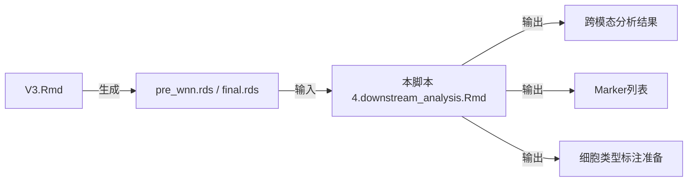

```{r setup, include=FALSE}
knitr::opts_chunk$set(
  echo = TRUE,
  warning = FALSE,
  message = FALSE,
  fig.width = 12,
  fig.height = 8,
  dpi = 300
)
```

# 脚本说明 {.tabset}

## 分析目标

本脚本是**脚本4的现代化重写版本**，专注于CITE-seq数据的深度分析：

### 🎯 核心分析内容

1. **基础QC可视化**（保留以确保数据质量）
   - UMI分布、线粒体百分比、基因数分布
   - 在降维空间中的展示

2. **双模态聚类对比**（基础展示）
   - RNA聚类 vs ADT聚类
   - 在各自降维空间中的展示

3. **🔥 跨模态可视化**（脚本4核心价值）
   - ADT聚类投影到RNA UMAP
   - RNA聚类投影到ADT UMAP
   - 评估两种模态的空间一致性

4. **🔥 跨模态Marker分析**（脚本4核心价值）
   - RNA markers → RNA clusters
   - ADT markers → ADT clusters
   - **RNA markers → ADT clusters** ← 关键！
   - **ADT markers → RNA clusters** ← 关键！

5. **🔥 单细胞高亮可视化**（脚本4特色）
   - 逐个cluster的细胞位置展示
   - 用于识别异常cluster

6. **细胞类型标注准备**
   - 导出marker列表（Excel格式）
   - 为手动标注提供数据基础

## 与V3的关系



**关键区别**：
- V3负责：数据加载、QC、降维、聚类、WNN整合
- 本脚本负责：**跨模态分析**、细胞类型标注、发表图准备

**冗余度**：约30%（基础QC和可视化）
**独特价值**：约70%（跨模态分析是本脚本的核心）

## 文献对应

本脚本复现了文献的以下分析：

- **Figure 1a**: 细胞类型标注的UMAP图
- **Supplementary Data**: Marker基因列表
- **方法学**: 跨模态验证策略

## 输入输出

### 📂 输入文件

```
results/Robjects/
├── GSE228544_{mode}_pre_wnn.rds     ← 优先使用（WNN前的对象）
└── GSE228544_{mode}_final.rds       ← 备选（包含WNN的对象）
```

### 📁 输出结构

```
downstream_results/
├── {mode}/
│   ├── Plots/
│   │   ├── QC/                    ← QC可视化
│   │   ├── Clustering/            ← 聚类对比
│   │   ├── CrossModal/            ← 🔥 跨模态分析
│   │   └── CellHighlight/         ← 单细胞高亮
│   ├── Robjects/
│   │   ├── markers_*.rds          ← Marker分析结果
│   │   └── annotated_obj.rds      ← 标注后的对象
│   └── Tables/
│       ├── RNA_markers_for_RNA_clusters.xlsx
│       ├── ADT_markers_for_ADT_clusters.xlsx
│       ├── RNA_markers_for_ADT_clusters.xlsx  ← 🔥 关键
│       └── ADT_markers_for_RNA_clusters.xlsx  ← 🔥 关键
```

## 使用方法

### RStudio 运行（推荐）

1. 打开 `4.downstream_analysis.Rmd`
2. 修改 Section 1.1 的 `analysis_mode` 参数
3. 点击 **Knit** 生成HTML报告

### 命令行运行

```bash
Rscript -e "rmarkdown::render('4.downstream_analysis.Rmd')"
```

---

# 配置与加载

## 分析模式配置

```{r analysis_mode}
################################################################################
########################## 🎯 分析模式设置 ######################################
################################################################################

# ==================== 选择分析模式 ====================
# 可选: "cDC1", "cDC2", "integrated", "full"
analysis_mode <- "integrated"  # 👈 在这里修改

# 验证
valid_modes <- c("cDC1", "cDC2", "integrated", "full")
if (!analysis_mode %in% valid_modes) {
  stop("❌ 无效的分析模式: ", analysis_mode,
       "\n   可选: ", paste(valid_modes, collapse = ", "))
}

cat("\n", strrep("=", 80), "\n")
cat("🎯 CITE-seq 下游分析\n")
cat("   分析模式:", analysis_mode, "\n")
cat(strrep("=", 80), "\n\n")
```

## 路径配置

```{r path_config}
################################################################################
########################## 📁 路径配置 ##########################################
################################################################################
#
# 重要说明：
# 1. .Rmd 文件的工作目录是文件所在目录
# 2. 使用相对路径确保可移植性
# 3. 所有路径在此集中配置，便于维护
#
################################################################################

# ==================== 显示当前工作目录 ====================
cat("📍 当前工作目录:", getwd(), "\n\n")

# ==================== 输入路径配置 ====================
# V3.Rmd 的输出目录（相对于当前.Rmd文件）
v3_output_dir <- "results/"
v3_robjects_dir <- file.path(v3_output_dir, "Robjects")

# 项目名称
project_name <- paste0("GSE228544_", analysis_mode)

# 输入文件（优先级：pre_wnn > final）
input_file_prewnn <- file.path(v3_robjects_dir, paste0(project_name, "_pre_wnn.rds"))
input_file_final <- file.path(v3_robjects_dir, paste0(project_name, "_final.rds"))

cat("📂 V3 输出目录:", v3_output_dir, "\n")
cat("📂 V3 Robjects:", v3_robjects_dir, "\n\n")

# ==================== 输出路径配置 ====================
# 本脚本的独立输出目录
output_base <- "downstream_results"
output_dir <- file.path(output_base, analysis_mode)

# 创建输出子目录
dir.create(output_dir, showWarnings = FALSE, recursive = TRUE)
dir.create(file.path(output_dir, "Plots"), showWarnings = FALSE, recursive = TRUE)
dir.create(file.path(output_dir, "Plots", "QC"), showWarnings = FALSE, recursive = TRUE)
dir.create(file.path(output_dir, "Plots", "Clustering"), showWarnings = FALSE, recursive = TRUE)
dir.create(file.path(output_dir, "Plots", "CrossModal"), showWarnings = FALSE, recursive = TRUE)
dir.create(file.path(output_dir, "Plots", "CellHighlight"), showWarnings = FALSE, recursive = TRUE)
dir.create(file.path(output_dir, "Robjects"), showWarnings = FALSE, recursive = TRUE)
dir.create(file.path(output_dir, "Tables"), showWarnings = FALSE, recursive = TRUE)

cat("📁 输出目录结构:\n")
cat("  根目录:", output_dir, "\n")
cat("  └─ Plots/\n")
cat("     ├─ QC/\n")
cat("     ├─ Clustering/\n")
cat("     ├─ CrossModal/\n")
cat("     └─ CellHighlight/\n")
cat("  └─ Robjects/\n")
cat("  └─ Tables/\n\n")

# ==================== 验证输入文件 ====================
cat("🔍 检查输入文件...\n")
# ✅ 修改优先级：优先使用 final.rds（包含WNN UMAP）
if (file.exists(input_file_final)) {
  input_file <- input_file_final
  cat("  ✅ 找到 final.rds（包含WNN UMAP）:", input_file, "\n")
} else if (file.exists(input_file_prewnn)) {
  input_file <- input_file_prewnn
  cat("  ⚠️  未找到 final.rds，使用 pre_wnn.rds（无WNN UMAP）:", input_file, "\n")
} else {
  stop("❌ 找不到输入文件:\n",
       "   尝试1: ", input_file_prewnn, "\n",
       "   尝试2: ", input_file_final, "\n",
       "   请先运行 CITE-seq_Complete_Analysis_v3.Rmd")
}

file_size_mb <- round(file.size(input_file) / 1024 / 1024, 2)
cat("  文件大小:", file_size_mb, "MB\n\n")
```

## 加载R包

```{r load_packages}
cat("📦 加载 R 包...\n")

suppressPackageStartupMessages({
  library(Seurat)
  library(tidyverse)
  library(ggplot2)
  library(patchwork)
  library(RColorBrewer)
  library(gridExtra)
  library(openxlsx)
  library(knitr)
  library(kableExtra)
})

cat("✅ R 包加载完成\n\n")
```

## 工具函数

```{r utility_functions}
################################################################################
########################## 🛠️ 工具函数 #########################################
################################################################################

#' 绘图并自动保存（PNG + PDF）
#'
#' @param plot ggplot对象
#' @param filename 文件名（不含扩展名）
#' @param subfolder 子文件夹（相对于output_dir/Plots/）
#' @param width 宽度（英寸）
#' @param height 高度（英寸）
#' @param dpi PNG分辨率
plot_and_save <- function(plot, filename, subfolder = "",
                          width = 10, height = 8, dpi = 300) {

  # 构建完整路径
  if (subfolder != "") {
    plot_dir <- file.path(output_dir, "Plots", subfolder)
  } else {
    plot_dir <- file.path(output_dir, "Plots")
  }

  # 确保目录存在
  dir.create(plot_dir, showWarnings = FALSE, recursive = TRUE)

  # 保存PNG
  png_path <- file.path(plot_dir, paste0(filename, ".png"))
  ggsave(png_path, plot, width = width, height = height, dpi = dpi, bg = "white")

  # 保存PDF
  pdf_path <- file.path(plot_dir, paste0(filename, ".pdf"))
  ggsave(pdf_path, plot, width = width, height = height, device = "pdf")

  # 显示图形
  print(plot)

  invisible(list(png = png_path, pdf = pdf_path))
}

#' 单细胞高亮显示
#'
#' @param metadata Seurat对象的meta.data
#' @param coords 坐标数据框（包含UMAP/tSNE坐标）
#' @param cells_highlight 要高亮的细胞ID
#' @param coord_x X轴列名
#' @param coord_y Y轴列名
colorSomeCells <- function(metadata, coords, cells_highlight,
                          coord_x = "UMAP_1", coord_y = "UMAP_2") {

  # 创建颜色向量
  metadata$highlight <- ifelse(rownames(metadata) %in% cells_highlight, "Highlighted", "Other")

  # 合并坐标
  plot_data <- cbind(coords, metadata[rownames(coords), , drop = FALSE])

  # 绘图
  p <- ggplot(plot_data, aes_string(x = coord_x, y = coord_y)) +
    geom_point(aes(color = highlight), size = 0.5, alpha = 0.6) +
    scale_color_manual(values = c("Highlighted" = "#E41A1C", "Other" = "grey80")) +
    theme_classic() +
    theme(
      legend.position = "right",
      plot.title = element_text(hjust = 0.5, size = 14, face = "bold")
    )

  return(p)
}

cat("✅ 工具函数加载完成\n\n")
```

---

# 加载数据

```{r load_data}
################################################################################
########################## 📂 加载 Seurat 对象 ##################################
################################################################################

cat("📂 加载数据:", basename(input_file), "\n")
seurat_obj <- readRDS(input_file)

cat("✅ 数据加载完成\n\n")

# ==================== 数据概览 ====================
cat("📊 数据概览:\n")
cat("  细胞数:", ncol(seurat_obj), "\n")
cat("  基因数:", nrow(seurat_obj[["RNA"]]), "\n")
cat("  ADT数:", nrow(seurat_obj[["ADT"]]), "\n\n")

# ==================== 检查必需组件 ====================
cat("🔍 检查数据组件:\n")

# Assays
assays_available <- names(seurat_obj@assays)
cat("  Assays:", paste(assays_available, collapse = ", "), "\n")

# Reductions
reductions_available <- names(seurat_obj@reductions)
cat("  降维:", paste(reductions_available, collapse = ", "), "\n")

# Metadata
required_meta <- c("nCount_RNA", "nFeature_RNA", "subsets_Mito_percent",
                   "SCT_clusters", "ADT_clusters")
meta_available <- required_meta[required_meta %in% colnames(seurat_obj@meta.data)]
cat("  Metadata:", paste(meta_available, collapse = ", "), "\n")

# 聚类信息
if ("SCT_clusters" %in% colnames(seurat_obj@meta.data)) {
  n_sct <- length(unique(seurat_obj$SCT_clusters))
  cat("  RNA聚类数:", n_sct, "\n")
}
if ("ADT_clusters" %in% colnames(seurat_obj@meta.data)) {
  n_adt <- length(unique(seurat_obj$ADT_clusters))
  cat("  ADT聚类数:", n_adt, "\n")
}

cat("\n")
```

---

# 🔥 感兴趣的基因列表（用户可自定义）

```{r genes_of_interest}
################################################################################
##################### 感兴趣的基因列表 ##########################################
################################################################################

# ==================== cDC1 发育阶段标志基因（6阶段）====================
genes_cDC1_stages <- list(
  `Pre-cDC1s` = c("S100a10", "Ccr2", "Vim", "Fcer1g", "Anxa2"),
  `Proliferating cDC1s` = c("Mki67", "Top2a", "Pcna", "Birc5", "Stmn1", "Cdca8"),
  `Early immature cDC1s` = c("Hspa5", "Pdia6", "Creld2", "Manf", "Cd8a"),
  `Late immature cDC1s` = c("Apoe", "Apol7c", "Nr4a2", "Nr4a3", "Egr3", "Cadm1"),
  `Early mature cDC1s` = c("Cxcl9", "Cxcl10", "Isg15", "Nfkbia", "Cd40"),
  `Late mature cDC1s` = c("Ccr7", "Fscn1", "Il12b", "Ccl5", "Cd63", "Relb")
)

# ==================== cDC2 发育阶段标志基因（5阶段）====================
genes_cDC2_stages <- list(
  `Pre-cDC2s` = c("Ly6d", "Siglech", "Runx2", "Vim", "Ccr2", "S100a10"),
  `Proliferating cDC2s` = c("Mki67", "Top2a", "Pcna", "Birc5", "Stmn1", "Cdca8"),
  `ESAM- immature cDC2s` = c("Cd209a", "Clec4a4", "Mgl2", "H2-DMb2"),
  `ESAM+ immature cDC2s` = c("Esam", "Tnfrsf9", "Cd81", "Clec12a"),
  `Mature cDC2s` = c("Ccr7", "Fscn1", "Cd40", "Cd86", "Relb", "Cd80")
)

# ==================== 谱系鉴定基因 ====================
genes_cDC1 <- c("Xcr1", "Clec9a", "Itgae", "Cadm1", "Batf3", "Irf8")
genes_cDC2 <- c("Sirpa", "Cd24a", "Notch2", "Clec4a4", "Irf4", "Klf4")

# ==================== 功能相关基因 ====================
genes_maturation <- c("Cd80", "Cd86", "Cd40", "Relb", "Cd83")
genes_migration <- c("Ccr7", "Fscn1", "Cxcl16", "Adam8", "Icam1")
genes_functional <- c("Mki67", "Top2a", "Il12b", "Tnf", "Il6", "Ifng")

# ==================== 🆕 扩展基因列表（8组）====================
genes_regulatory <- c("Cd274", "Pdcd1lg2", "Cd200", "Fas", "Aldh1a2", "Socs1", "Socs2")
genes_migration_extended <- c("Ccr7", "Myo1g", "Cxcl16", "Adam8", "Icam1", "Fscn1", "Marcks", "Marcksl1")
genes_markers <- c("H2-Ab1", "Itgax", "Itgam", "Itgae", "Xcr1", "Sirpa", "Cd24a")
genes_maturation_extended <- c("Cd80", "Cd86", "Cd40", "Relb", "Cd83")
genes_th2_response <- c("Il4ra", "Il4i1", "Ccl17", "Ccl22", "Tnfrsf4", "Stat6", "Bcl2l1")
genes_transcription_factors <- c("Sfpi1", "Zbtb46", "Irf8", "Nfil3", "Id2", "Batf3",
                                  "Irf4", "Cebpa", "Cebpb", "Zeb2", "Klf4", "Tbx21",
                                  "Rorc", "Notch2", "Nr4a3")
genes_developmental_gating <- c("Itgax", "H2-Ab1", "Flt3", "Kit", "Sirpa", "Csf1r",
                                "Siglech", "Ly6c1", "Itgam", "Spn", "Fcgr1", "Ly6d")

# 整合为一个列表（方便后续使用）
genes_extended_groups <- list(
  `调控基因` = genes_regulatory,
  `迁移基因` = genes_migration_extended,
  `标记基因` = genes_markers,
  `成熟基因` = genes_maturation_extended,
  `TH2反应基因` = genes_th2_response,
  `转录因子` = genes_transcription_factors,
  `发育门控` = genes_developmental_gating
)

# ==================== 🆕 ADT 蛋白列表 ====================
# 注意：ADT蛋白名称格式可能因数据而异，常见格式包括：
# "adt_CD11c", "adt-CD11c", "CD11c-adt" 等
# 这里列出常见格式，脚本会自动检测可用的
adt_developmental_gating <- c("adt_CD11c", "adt_IA-IE", "adt_CD135", "adt_CD117",
                               "adt_CD172a", "adt_CD115", "adt_SiglecH", "adt_Ly6C",
                               "adt_CD11b", "adt_CD43", "adt_CD64", "adt_Ly6D")

# 整合为列表
adt_extended_groups <- list(
  `蛋白_发育门控` = adt_developmental_gating
)

# ==================== 根据分析模式选择基因 ====================
if (analysis_mode == "cDC1") {
  genes_stages <- genes_cDC1_stages
  genes_primary <- unlist(genes_cDC1_stages, use.names = FALSE)
  genes_lineage <- genes_cDC1
} else if (analysis_mode == "cDC2") {
  genes_stages <- genes_cDC2_stages
  genes_primary <- unlist(genes_cDC2_stages, use.names = FALSE)
  genes_lineage <- genes_cDC2
} else if (analysis_mode == "integrated") {
  genes_stages <- c(genes_cDC1_stages, genes_cDC2_stages)
  genes_primary <- unique(c(unlist(genes_cDC1_stages), unlist(genes_cDC2_stages)))
  genes_lineage <- c(genes_cDC1, genes_cDC2)
} else {
  genes_stages <- genes_cDC1_stages
  genes_primary <- unlist(genes_cDC1_stages, use.names = FALSE)
  genes_lineage <- genes_cDC1
}

# 去重
genes_primary <- unique(genes_primary)
genes_lineage <- unique(genes_lineage)

cat("📊 基因列表配置完成:\n")
cat("  - 发育阶段数:", length(genes_stages), "\n")
cat("  - 主要基因数:", length(genes_primary), "\n")
cat("  - 谱系基因数:", length(genes_lineage), "\n\n")
```

---

# QC可视化（基础保留）

## UMI分布

```{r qc_umi, fig.width=16, fig.height=7}
################################################################################
########################## QC: UMI 分布 #########################################
################################################################################

cat("📊 生成 UMI 分布图...\n")

# 准备数据
metadata <- seurat_obj@meta.data

# 在UMAP上显示UMI
if ("umap" %in% reductions_available) {
  umap_coords <- as.data.frame(seurat_obj[["umap"]]@cell.embeddings)
  colnames(umap_coords) <- c("UMAP_1", "UMAP_2")

  plot_data <- cbind(umap_coords, metadata[rownames(umap_coords), ])

  p_umi_umap <- ggplot(plot_data, aes(x = UMAP_1, y = UMAP_2, color = nCount_RNA)) +
    geom_point(size = 0.5, alpha = 0.6) +
    scale_color_gradientn(colours = c("darkblue", "cyan", "green", "yellow", "orange", "darkred"),
                         name = "UMI Count") +
    labs(title = "UMI Distribution on RNA UMAP",
         subtitle = paste0("Total cells: ", ncol(seurat_obj))) +
    theme_classic() +
    theme(plot.title = element_text(hjust = 0.5, face = "bold"))

  plot_and_save(p_umi_umap, "QC_UMI_distribution_umap", "QC", width = 10, height = 8)
}

# Violin plot
p_umi_violin <- VlnPlot(seurat_obj, features = "nCount_RNA", group.by = "SCT_clusters",
                        pt.size = 0) +
  labs(title = "UMI Count per Cluster", x = "Cluster", y = "UMI Count") +
  theme(axis.text.x = element_text(angle = 0))

plot_and_save(p_umi_violin, "QC_UMI_violin", "QC", width = 14, height = 6)

cat("✓ UMI分布图已保存\n\n")
```

## 线粒体百分比

```{r qc_mito, fig.width=16, fig.height=7}
cat("📊 生成线粒体百分比分布图...\n")

# 在UMAP上显示线粒体百分比
if ("umap" %in% reductions_available && "subsets_Mito_percent" %in% colnames(metadata)) {

  p_mito_umap <- ggplot(plot_data, aes(x = UMAP_1, y = UMAP_2, color = subsets_Mito_percent)) +
    geom_point(size = 0.5, alpha = 0.6) +
    scale_color_gradientn(colours = c("darkblue", "cyan", "green", "yellow", "orange", "darkred"),
                         name = "Mito %") +
    labs(title = "Mitochondrial Percentage on RNA UMAP",
         subtitle = "Quality control metric") +
    theme_classic() +
    theme(plot.title = element_text(hjust = 0.5, face = "bold"))

  plot_and_save(p_mito_umap, "QC_mito_distribution_umap", "QC", width = 10, height = 8)
}

# Violin plot
if ("subsets_Mito_percent" %in% colnames(metadata)) {
  p_mito_violin <- VlnPlot(seurat_obj, features = "subsets_Mito_percent",
                           group.by = "SCT_clusters", pt.size = 0) +
    labs(title = "Mitochondrial Percentage per Cluster",
         x = "Cluster", y = "Mito %") +
    theme(axis.text.x = element_text(angle = 0))

  plot_and_save(p_mito_violin, "QC_mito_violin", "QC", width = 14, height = 6)
}

cat("✓ 线粒体分布图已保存\n\n")
```

## 基因数分布

```{r qc_genes, fig.width=16, fig.height=7}
cat("📊 生成基因数分布图...\n")

# Violin plot
p_genes_violin <- VlnPlot(seurat_obj, features = "nFeature_RNA",
                          group.by = "SCT_clusters", pt.size = 0) +
  labs(title = "Gene Count per Cluster", x = "Cluster", y = "Gene Count") +
  theme(axis.text.x = element_text(angle = 0))

plot_and_save(p_genes_violin, "QC_genes_violin", "QC", width = 14, height = 6)

cat("✓ 基因数分布图已保存\n\n")
```

---

# 基础聚类可视化（保留）

## RNA聚类

```{r clustering_rna, fig.width=16, fig.height=7}
cat("📊 生成 RNA 聚类可视化...\n")

# UMAP
if ("umap" %in% reductions_available) {
  p_rna_umap <- DimPlot(seurat_obj, reduction = "umap", group.by = "SCT_clusters",
                        label = TRUE, repel = TRUE, label.size = 5) +
    labs(title = "RNA (SCT) Clusters on RNA UMAP",
         subtitle = paste0(length(unique(seurat_obj$SCT_clusters)), " clusters")) +
    theme(plot.title = element_text(hjust = 0.5, face = "bold"))

  plot_and_save(p_rna_umap, "clustering_RNA_umap", "Clustering", width = 10, height = 8)
}

# tSNE
if ("tsne" %in% reductions_available) {
  p_rna_tsne <- DimPlot(seurat_obj, reduction = "tsne", group.by = "SCT_clusters",
                        label = TRUE, repel = TRUE, label.size = 5) +
    labs(title = "RNA (SCT) Clusters on RNA tSNE",
         subtitle = paste0(length(unique(seurat_obj$SCT_clusters)), " clusters")) +
    theme(plot.title = element_text(hjust = 0.5, face = "bold"))

  plot_and_save(p_rna_tsne, "clustering_RNA_tsne", "Clustering", width = 10, height = 8)
}

cat("✓ RNA聚类图已保存\n\n")
```

## ADT聚类

```{r clustering_adt, fig.width=16, fig.height=7}
cat("📊 生成 ADT 聚类可视化...\n")

# UMAP
if ("adt_umap" %in% reductions_available) {
  p_adt_umap <- DimPlot(seurat_obj, reduction = "adt_umap", group.by = "ADT_clusters",
                        label = TRUE, repel = TRUE, label.size = 5) +
    labs(title = "ADT (Protein) Clusters on ADT UMAP",
         subtitle = paste0(length(unique(seurat_obj$ADT_clusters)), " clusters")) +
    theme(plot.title = element_text(hjust = 0.5, face = "bold"))

  plot_and_save(p_adt_umap, "clustering_ADT_umap", "Clustering", width = 10, height = 8)
}

# tSNE
if ("adt_tsne" %in% reductions_available) {
  p_adt_tsne <- DimPlot(seurat_obj, reduction = "adt_tsne", group.by = "ADT_clusters",
                        label = TRUE, repel = TRUE, label.size = 5) +
    labs(title = "ADT (Protein) Clusters on ADT tSNE",
         subtitle = paste0(length(unique(seurat_obj$ADT_clusters)), " clusters")) +
    theme(plot.title = element_text(hjust = 0.5, face = "bold"))

  plot_and_save(p_adt_tsne, "clustering_ADT_tsne", "Clustering", width = 10, height = 8)
}

cat("✓ ADT聚类图已保存\n\n")
```

---

# 🔥 跨模态分析解读指南 {.tabset}

## 什么是跨模态分析

### 📚 基本概念

**CITE-seq = RNA + Protein（ADT）**

在CITE-seq实验中，我们同时测量了：
- **RNA（转录组）**：细胞表达的mRNA
- **Protein（蛋白质组）**：细胞表面的蛋白质标记（通过抗体标记）

### 🎯 两种聚类策略

我们可以用两种方式对细胞进行聚类：

1. **RNA-driven clustering（RNA聚类）**
   - 基于基因表达相似性
   - 反映**转录状态**
   - 分辨率高，能捕捉细微的转录差异

2. **ADT-driven clustering（ADT聚类）**
   - 基于蛋白表达相似性
   - 反映**蛋白表型**
   - 更稳定，受技术噪音影响小

### ❓ 核心问题

**这两种聚类方法会给出相同的结果吗？**

- 如果**一致**：说明蛋白和RNA高度相关，细胞类型定义清晰
- 如果**不一致**：说明存在转录-蛋白解偶联，可能揭示新的生物学机制

## 为什么要跨模态分析

### 🔬 科学意义

#### 1. **验证聚类的稳健性**
- 如果RNA和ADT聚类高度一致 → 细胞类型定义可靠
- 如果不一致 → 需要深入探究原因

#### 2. **发现转录-蛋白解偶联**
```
RNA高表达 ≠ 蛋白高表达

可能原因：
- 转录后调控
- 蛋白降解
- 蛋白转运
- 翻译效率差异
```

#### 3. **互补的生物学信息**
- **RNA markers**：告诉我们细胞在"做什么"（转录程序）
- **Protein markers**：告诉我们细胞"是什么"（表型特征）

### 📊 具体例子

假设我们发现：

**情况1：高度一致**
```
ADT cluster 2 的细胞：
- 在RNA UMAP上也聚在一起
- RNA markers: Ccr7高表达
- ADT markers: CD86高表达
→ 解读：成熟DC，转录-蛋白一致
```

**情况2：部分一致**
```
ADT cluster 3 的细胞：
- 在RNA UMAP上分散在2个位置
- RNA markers: 一部分高表达Irf8，一部分高表达Irf4
- ADT markers: 都高表达CD11c
→ 解读：蛋白表型相同（都是DC），但转录状态不同（cDC1 vs cDC2）
```

**情况3：完全不一致**
```
RNA cluster 5 的细胞：
- 在ADT UMAP上分散在多个位置
- RNA markers: 增殖相关基因（Mki67, Pcna）
- ADT markers: 无明显特异性
→ 解读：处于增殖状态的不同细胞类型，RNA特征统一但蛋白异质
```

## 如何解读结果

### 📈 第一步：看空间投影

#### 查看这些图：
- `crossmodal_ADT_on_RNA_umap.png`
- `crossmodal_RNA_on_ADT_umap.png`
- `crossmodal_quad_comparison.png` ← **最重要**

#### 判断标准：

**🟢 完美一致**
```
ADT clusters 在 RNA UMAP 上：
- 每个ADT cluster占据独立区域
- 边界清晰，无重叠
→ 解读：两种模态高度一致，细胞类型定义可靠
```

**🟡 部分一致**
```
ADT clusters 在 RNA UMAP 上：
- 大部分cluster有独立区域
- 某些cluster有部分重叠
→ 解读：主要细胞类型一致，某些亚群有差异
```

**🔴 完全不一致**
```
ADT clusters 在 RNA UMAP 上：
- 同一个ADT cluster分散在多个区域
- 不同ADT cluster高度重叠
→ 解读：RNA和蛋白捕捉到不同的细胞异质性
```

### 📊 第二步：看Marker基因

#### 查看这些表格：
1. `RNA_markers_for_RNA_clusters.xlsx` - 基线
2. `ADT_markers_for_ADT_clusters.xlsx` - 基线
3. **🔥 `RNA_markers_for_ADT_clusters.xlsx`** - 关键！
4. **🔥 `ADT_markers_for_RNA_clusters.xlsx`** - 关键！

#### 分析逻辑：

**步骤1：理解ADT聚类的生物学身份**
```excel
打开：RNA_markers_for_ADT_clusters.xlsx

查看 ADT cluster 2 的 top markers：
- Ccr7      (高)  → 迁移型DC
- Fscn1     (高)  → 成熟DC
- Il12b     (高)  → Th1极化能力
- Relb      (高)  → 成熟标志

解读：ADT cluster 2 = 迁移型成熟DC（Migratory cDC）
```

**步骤2：理解RNA聚类的蛋白表型**
```excel
打开：ADT_markers_for_RNA_clusters.xlsx

查看 RNA cluster 5 的 top markers：
- CD86      (高)  → 共刺激分子
- MHCII     (高)  → 抗原提呈
- CD40      (高)  → 活化标志

解读：RNA cluster 5 在蛋白水平表现为活化的抗原提呈细胞
```

**步骤3：交叉验证**
```
比较：
- ADT cluster 2 的 RNA markers
- RNA cluster X 的 ADT markers

如果匹配：
→ 这两个cluster可能是同一群细胞
→ 可以合并标注

如果不匹配：
→ 揭示了有趣的生物学差异
→ 需要进一步探究
```

### 🔦 第三步：看单细胞高亮图

#### 查看目录：`CellHighlight/`

这些图展示每个cluster的**空间分布**：

**分析要点：**

1. **Cluster紧密度**
   ```
   紧密聚集 → 细胞类型同质
   分散分布 → 可能包含亚群
   ```

2. **位置关系**
   ```
   相邻cluster → 可能有发育关系或共同起源
   远离cluster → 功能差异大
   ```

3. **异常识别**
   ```
   孤立的小cluster → 可能是doublets
   跨越大片区域 → 可能是质控问题
   ```

## 实战案例解读

### 案例1：成熟DC的识别

**观察到的现象：**
```
ADT cluster 3 在 RNA UMAP 上：
- 主要位于右上角区域
- 与 RNA cluster 7 高度重叠

RNA markers for ADT cluster 3:
- Ccr7, Fscn1, Relb, Cd40 (高表达)

ADT markers for RNA cluster 7:
- CD86, MHCII, CD80 (高表达)
```

**解读：**
```
✅ 空间一致：两个cluster在同一区域
✅ Marker一致：都表达成熟标志
→ 结论：ADT cluster 3 = RNA cluster 7 = 成熟迁移型DC
```

### 案例2：增殖细胞的发现

**观察到的现象：**
```
RNA cluster 4：
- 在 ADT UMAP 上分散在多个位置
- RNA markers: Mki67, Top2a, Pcna (增殖标志)
- ADT markers: 无明显特异性

ADT clusters 包含 RNA cluster 4 的细胞：
- ADT cluster 1: 部分细胞来自 RNA cluster 4
- ADT cluster 2: 部分细胞来自 RNA cluster 4
```

**解读：**
```
💡 发现：处于增殖期的不同DC亚型
- 它们的转录特征统一（增殖程序）
- 但保留了各自的蛋白表型
→ 结论：增殖是一个跨细胞类型的状态
```

### 案例3：转录-蛋白解偶联

**观察到的现象：**
```
ADT cluster 5：
- 高表达 CD86 蛋白
- 但 RNA level 的 Cd86 表达不高

RNA markers for ADT cluster 5:
- Irf8, Batf3 (转录因子)
- 无 Cd86 在 top markers
```

**解读：**
```
⚠️ 解偶联现象：
- 蛋白水平：CD86高（功能活跃）
- 转录水平：Cd86不高（可能已稳定）
→ 可能机制：
  1. 蛋白半衰期长，转录已下调
  2. 翻译后修饰增强蛋白稳定性
  3. 细胞处于稳态，新转录不多
```

## 常见模式总结

### 🟢 模式1：高度一致（最常见）

**特征：**
- 空间投影重叠度高
- Marker基因功能相关
- 生物学解释清晰

**意义：**
- 细胞类型定义可靠
- 可以放心地用于后续分析

---

### 🟡 模式2：部分一致（需要深入分析）

**特征：**
- 主要cluster一致，少数不一致
- 某些marker有差异

**可能原因：**
1. **细胞状态差异**（如活化 vs 静息）
2. **细胞周期影响**（如G1 vs S期）
3. **微环境差异**（如组织不同区域）

**应对策略：**
- 进一步检查不一致的cluster
- 使用细胞周期评分
- 检查批次效应

---

### 🔴 模式3：完全不一致（重要发现！）

**特征：**
- 空间投影高度分散
- Marker基因功能不相关

**可能原因：**
1. **技术问题**
   - ADT抗体特异性差
   - RNA质量问题
   - 批次效应严重

2. **生物学发现**（更有趣！）
   - 转录-翻译解偶联
   - 蛋白稳定性调控
   - 新的细胞亚群

**应对策略：**
- 检查技术质控指标
- 查阅文献验证
- 进行功能实验验证

---

# 🔥 跨模态可视化（脚本4核心）

> **使用上面的解读指南来理解下面的结果**

## ADT聚类在RNA空间

```{r crossmodal_adt_on_rna, fig.width=18, fig.height=7}
################################################################################
################## 🔥 跨模态可视化：ADT clusters on RNA space ##################
################################################################################

cat("🔥 生成跨模态可视化：ADT聚类投影到RNA空间...\n")

if ("umap" %in% reductions_available) {
  # UMAP
  p_adt_on_rna_umap <- DimPlot(seurat_obj, reduction = "umap", group.by = "ADT_clusters",
                               label = TRUE, repel = TRUE, label.size = 5) +
    labs(title = "ADT Clusters Projected on RNA UMAP",
         subtitle = "Evaluating protein-driven clustering in transcriptome space") +
    theme(plot.title = element_text(hjust = 0.5, face = "bold"))

  plot_and_save(p_adt_on_rna_umap, "crossmodal_ADT_on_RNA_umap", "CrossModal",
                width = 10, height = 8)
}

if ("tsne" %in% reductions_available) {
  # tSNE
  p_adt_on_rna_tsne <- DimPlot(seurat_obj, reduction = "tsne", group.by = "ADT_clusters",
                               label = TRUE, repel = TRUE, label.size = 5) +
    labs(title = "ADT Clusters Projected on RNA tSNE",
         subtitle = "Evaluating protein-driven clustering in transcriptome space") +
    theme(plot.title = element_text(hjust = 0.5, face = "bold"))

  plot_and_save(p_adt_on_rna_tsne, "crossmodal_ADT_on_RNA_tsne", "CrossModal",
                width = 10, height = 8)
}

cat("✓ ADT→RNA投影图已保存\n\n")
```

## RNA聚类在ADT空间

```{r crossmodal_rna_on_adt, fig.width=18, fig.height=7}
cat("🔥 生成跨模态可视化：RNA聚类投影到ADT空间...\n")

if ("adt_umap" %in% reductions_available) {
  # UMAP
  p_rna_on_adt_umap <- DimPlot(seurat_obj, reduction = "adt_umap", group.by = "SCT_clusters",
                               label = TRUE, repel = TRUE, label.size = 5) +
    labs(title = "RNA Clusters Projected on ADT UMAP",
         subtitle = "Evaluating transcriptome-driven clustering in protein space") +
    theme(plot.title = element_text(hjust = 0.5, face = "bold"))

  plot_and_save(p_rna_on_adt_umap, "crossmodal_RNA_on_ADT_umap", "CrossModal",
                width = 10, height = 8)
}

if ("adt_tsne" %in% reductions_available) {
  # tSNE
  p_rna_on_adt_tsne <- DimPlot(seurat_obj, reduction = "adt_tsne", group.by = "SCT_clusters",
                               label = TRUE, repel = TRUE, label.size = 5) +
    labs(title = "RNA Clusters Projected on ADT tSNE",
         subtitle = "Evaluating transcriptome-driven clustering in protein space") +
    theme(plot.title = element_text(hjust = 0.5, face = "bold"))

  plot_and_save(p_rna_on_adt_tsne, "crossmodal_RNA_on_ADT_tsne", "CrossModal",
                width = 10, height = 8)
}

cat("✓ RNA→ADT投影图已保存\n\n")
```

## 四联图对比

```{r crossmodal_quad, fig.width=20, fig.height=16}
cat("🔥 生成四联图对比...\n")

if ("umap" %in% reductions_available && "adt_umap" %in% reductions_available) {

  # 准备4个图
  p1 <- DimPlot(seurat_obj, reduction = "umap", group.by = "SCT_clusters",
                label = TRUE, repel = TRUE, label.size = 4) +
    labs(title = "RNA Clusters on RNA UMAP") +
    theme(plot.title = element_text(hjust = 0.5, size = 12, face = "bold"))

  p2 <- DimPlot(seurat_obj, reduction = "adt_umap", group.by = "ADT_clusters",
                label = TRUE, repel = TRUE, label.size = 4) +
    labs(title = "ADT Clusters on ADT UMAP") +
    theme(plot.title = element_text(hjust = 0.5, size = 12, face = "bold"))

  p3 <- DimPlot(seurat_obj, reduction = "umap", group.by = "ADT_clusters",
                label = TRUE, repel = TRUE, label.size = 4) +
    labs(title = "ADT Clusters on RNA UMAP (Cross-modal)") +
    theme(plot.title = element_text(hjust = 0.5, size = 12, face = "bold"))

  p4 <- DimPlot(seurat_obj, reduction = "adt_umap", group.by = "SCT_clusters",
                label = TRUE, repel = TRUE, label.size = 4) +
    labs(title = "RNA Clusters on ADT UMAP (Cross-modal)") +
    theme(plot.title = element_text(hjust = 0.5, size = 12, face = "bold"))

  # 组合
  p_quad <- (p1 | p3) / (p2 | p4) +
    plot_annotation(title = "Cross-Modal Clustering Comparison",
                    subtitle = "Left: Same-modal | Right: Cross-modal",
                    theme = theme(plot.title = element_text(hjust = 0.5, size = 16, face = "bold"),
                                 plot.subtitle = element_text(hjust = 0.5, size = 12)))

  plot_and_save(p_quad, "crossmodal_quad_comparison", "CrossModal",
                width = 20, height = 16)
}

cat("✓ 四联图已保存\n\n")
```

---

# 🔥 跨模态Marker分析（脚本4核心）

> **核心价值**：理解不同模态驱动的聚类的生物学特征

## RNA markers for RNA clusters

```{r markers_rna_rna}
################################################################################
################ Marker分析 1/4: RNA markers for RNA clusters ##################
################################################################################

cat("🔬 分析 RNA markers for RNA clusters...\n")

Idents(seurat_obj) <- seurat_obj$SCT_clusters

markers_rna_rna <- FindAllMarkers(seurat_obj,
                                  assay = "SCT",
                                  only.pos = TRUE,
                                  min.pct = 0.25,
                                  logfc.threshold = 0.25,
                                  verbose = FALSE)

cat("  发现", nrow(markers_rna_rna), "个marker基因\n")

# 保存RDS
saveRDS(markers_rna_rna,
        file.path(output_dir, "Robjects", "markers_RNA_for_RNA_clusters.rds"))

# 计算score并按cluster整理
markers_rna_rna$score <- markers_rna_rna$pct.1 / (markers_rna_rna$pct.2 + 0.01) *
                         markers_rna_rna$avg_log2FC

marker_list <- split(markers_rna_rna, markers_rna_rna$cluster)
marker_list <- lapply(marker_list, function(x) {
  x[order(x$score, decreasing = TRUE), ]
})

# 保存Excel
write.xlsx(marker_list,
           file.path(output_dir, "Tables", "RNA_markers_for_RNA_clusters.xlsx"))

cat("  ✓ 已保存到 Tables/RNA_markers_for_RNA_clusters.xlsx\n\n")

# 显示Top markers
top_markers <- markers_rna_rna %>%
  group_by(cluster) %>%
  slice_max(order_by = score, n = 3) %>%
  select(cluster, gene, avg_log2FC, pct.1, pct.2, score)

kable(top_markers, caption = "Top 3 RNA Markers per RNA Cluster") %>%
  kable_styling(bootstrap_options = c("striped", "hover", "condensed"))
```

## ADT markers for ADT clusters

```{r markers_adt_adt}
################################################################################
################ Marker分析 2/4: ADT markers for ADT clusters ##################
################################################################################

cat("🔬 分析 ADT markers for ADT clusters...\n")

Idents(seurat_obj) <- seurat_obj$ADT_clusters

markers_adt_adt <- FindAllMarkers(seurat_obj,
                                  assay = "ADT",
                                  only.pos = TRUE,
                                  min.pct = 0.25,
                                  logfc.threshold = 0.25,
                                  verbose = FALSE)

cat("  发现", nrow(markers_adt_adt), "个marker蛋白\n")

# 保存RDS
saveRDS(markers_adt_adt,
        file.path(output_dir, "Robjects", "markers_ADT_for_ADT_clusters.rds"))

# 计算score并按cluster整理
markers_adt_adt$score <- markers_adt_adt$pct.1 / (markers_adt_adt$pct.2 + 0.01) *
                         markers_adt_adt$avg_log2FC

marker_list <- split(markers_adt_adt, markers_adt_adt$cluster)
marker_list <- lapply(marker_list, function(x) {
  x[order(x$score, decreasing = TRUE), ]
})

# 保存Excel
write.xlsx(marker_list,
           file.path(output_dir, "Tables", "ADT_markers_for_ADT_clusters.xlsx"))

cat("  ✓ 已保存到 Tables/ADT_markers_for_ADT_clusters.xlsx\n\n")

# 显示Top markers
top_markers <- markers_adt_adt %>%
  group_by(cluster) %>%
  slice_max(order_by = score, n = 3) %>%
  select(cluster, gene, avg_log2FC, pct.1, pct.2, score)

kable(top_markers, caption = "Top 3 ADT Markers per ADT Cluster") %>%
  kable_styling(bootstrap_options = c("striped", "hover", "condensed"))
```

## 🔥 RNA markers for ADT clusters

```{r markers_rna_adt}
################################################################################
########## 🔥 Marker分析 3/4: RNA markers for ADT clusters (关键!) ##############
################################################################################

cat("🔥 分析 RNA markers for ADT clusters（跨模态分析）...\n")
cat("   目的：用基因表达描述蛋白驱动的聚类\n")

Idents(seurat_obj) <- seurat_obj$ADT_clusters

markers_rna_adt <- FindAllMarkers(seurat_obj,
                                  assay = "SCT",
                                  only.pos = TRUE,
                                  min.pct = 0.25,
                                  logfc.threshold = 0.25,
                                  verbose = FALSE)

cat("  发现", nrow(markers_rna_adt), "个marker基因\n")

# 保存RDS
saveRDS(markers_rna_adt,
        file.path(output_dir, "Robjects", "markers_RNA_for_ADT_clusters.rds"))

# 计算score并按cluster整理
markers_rna_adt$score <- markers_rna_adt$pct.1 / (markers_rna_adt$pct.2 + 0.01) *
                         markers_rna_adt$avg_log2FC

marker_list <- split(markers_rna_adt, markers_rna_adt$cluster)
marker_list <- lapply(marker_list, function(x) {
  x[order(x$score, decreasing = TRUE), ]
})

# 保存Excel
write.xlsx(marker_list,
           file.path(output_dir, "Tables", "RNA_markers_for_ADT_clusters.xlsx"))

cat("  ✓ 已保存到 Tables/RNA_markers_for_ADT_clusters.xlsx\n")
cat("  🔥 这是跨模态分析的关键结果！\n\n")

# 显示Top markers
top_markers <- markers_rna_adt %>%
  group_by(cluster) %>%
  slice_max(order_by = score, n = 5) %>%
  select(cluster, gene, avg_log2FC, pct.1, pct.2, score)

kable(top_markers, caption = "Top 5 RNA Markers per ADT Cluster (Cross-modal)") %>%
  kable_styling(bootstrap_options = c("striped", "hover", "condensed"))
```

## 🔥 ADT markers for RNA clusters

```{r markers_adt_rna}
################################################################################
########## 🔥 Marker分析 4/4: ADT markers for RNA clusters (关键!) ##############
################################################################################

cat("🔥 分析 ADT markers for RNA clusters（跨模态分析）...\n")
cat("   目的：用蛋白表达描述基因驱动的聚类\n")

Idents(seurat_obj) <- seurat_obj$SCT_clusters

markers_adt_rna <- FindAllMarkers(seurat_obj,
                                  assay = "ADT",
                                  only.pos = TRUE,
                                  min.pct = 0.25,
                                  logfc.threshold = 0.25,
                                  verbose = FALSE)

cat("  发现", nrow(markers_adt_rna), "个marker蛋白\n")

# 保存RDS
saveRDS(markers_adt_rna,
        file.path(output_dir, "Robjects", "markers_ADT_for_RNA_clusters.rds"))

# 计算score并按cluster整理
markers_adt_rna$score <- markers_adt_rna$pct.1 / (markers_adt_rna$pct.2 + 0.01) *
                         markers_adt_rna$avg_log2FC

marker_list <- split(markers_adt_rna, markers_adt_rna$cluster)
marker_list <- lapply(marker_list, function(x) {
  x[order(x$score, decreasing = TRUE), ]
})

# 保存Excel
write.xlsx(marker_list,
           file.path(output_dir, "Tables", "ADT_markers_for_RNA_clusters.xlsx"))

cat("  ✓ 已保存到 Tables/ADT_markers_for_RNA_clusters.xlsx\n")
cat("  🔥 这是跨模态分析的关键结果！\n\n")

# 显示Top markers
top_markers <- markers_adt_rna %>%
  group_by(cluster) %>%
  slice_max(order_by = score, n = 5) %>%
  select(cluster, gene, avg_log2FC, pct.1, pct.2, score)

kable(top_markers, caption = "Top 5 ADT Markers per RNA Cluster (Cross-modal)") %>%
  kable_styling(bootstrap_options = c("striped", "hover", "condensed"))
```

---

# 🔥 单细胞高亮可视化（脚本4特色）

> **目的**：逐个cluster展示细胞位置，用于识别异常cluster

## RNA clusters高亮

```{r highlight_rna_clusters, fig.width=10, fig.height=8, results='hide'}
cat("🔦 生成 RNA clusters 单细胞高亮图...\n")

if ("umap" %in% reductions_available) {

  # 准备UMAP坐标
  umap_coords <- as.data.frame(seurat_obj[["umap"]]@cell.embeddings)
  colnames(umap_coords) <- c("UMAP_1", "UMAP_2")
  metadata <- seurat_obj@meta.data

  # 为每个RNA cluster创建高亮图
  rna_clusters <- sort(unique(seurat_obj$SCT_clusters))

  for (cluster_id in rna_clusters) {
    # 获取该cluster的细胞
    cells_in_cluster <- WhichCells(seurat_obj,
                                   expression = SCT_clusters == cluster_id)

    # 创建高亮图
    p <- colorSomeCells(metadata, umap_coords, cells_in_cluster,
                       coord_x = "UMAP_1", coord_y = "UMAP_2") +
      labs(title = paste0("RNA Cluster ", cluster_id),
           subtitle = paste0(length(cells_in_cluster), " cells"))

    # 保存
    plot_and_save(p, paste0("highlight_RNA_cluster_", cluster_id),
                  "CellHighlight", width = 8, height = 7)
  }

  cat("  ✓ 已生成", length(rna_clusters), "个RNA cluster高亮图\n\n")
}
```

## ADT clusters高亮

```{r highlight_adt_clusters, fig.width=10, fig.height=8, results='hide'}
cat("🔦 生成 ADT clusters 单细胞高亮图...\n")

if ("adt_umap" %in% reductions_available) {

  # 准备ADT UMAP坐标
  adt_umap_coords <- as.data.frame(seurat_obj[["adt_umap"]]@cell.embeddings)
  colnames(adt_umap_coords) <- c("adtUMAP_1", "adtUMAP_2")
  metadata <- seurat_obj@meta.data

  # 为每个ADT cluster创建高亮图
  adt_clusters <- sort(unique(seurat_obj$ADT_clusters))

  for (cluster_id in adt_clusters) {
    # 获取该cluster的细胞
    cells_in_cluster <- WhichCells(seurat_obj,
                                   expression = ADT_clusters == cluster_id)

    # 创建高亮图
    p <- colorSomeCells(metadata, adt_umap_coords, cells_in_cluster,
                       coord_x = "adtUMAP_1", coord_y = "adtUMAP_2") +
      labs(title = paste0("ADT Cluster ", cluster_id),
           subtitle = paste0(length(cells_in_cluster), " cells"))

    # 保存
    plot_and_save(p, paste0("highlight_ADT_cluster_", cluster_id),
                  "CellHighlight", width = 8, height = 7)
  }

  cat("  ✓ 已生成", length(adt_clusters), "个ADT cluster高亮图\n\n")
}
```

---

# 🔥 作者注释导入与分析

> **本节核心功能**：
> 1. 导入作者的原始细胞类型注释（两版：详细版和最终版）
> 2. 对比您的聚类结果与作者注释的关系
> 3. 反推作者注释时依赖的差异基因
> 4. 为后续拟时序分析做准备

## 导入作者注释

```{r import_author_annotation}
################################################################################
##################### 🔥 导入作者原始注释 ######################################
################################################################################

cat("
", strrep("=", 80), "
")
cat("🔥 导入作者原始注释
")
cat(strrep("=", 80), "

")

# ==================== 加载包含原始注释的 metadata ====================
# metadata_original 存储在 CITE-seq_Complete_Analysis_v3.Rmd 生成的缓存文件中
# 文件名格式：{mode}_01_subset_extracted.rds（如 cDC1_01_subset_extracted.rds）

# 构建缓存文件路径（缓存文件在 results/Cache/ 目录）
v3_cache_dir <- file.path(v3_output_dir, "Cache")

if (analysis_mode == "integrated") {
  subset_cache_file <- file.path(v3_cache_dir, "integrated_01_subset_extracted.rds")
} else {
  subset_cache_file <- file.path(v3_cache_dir, paste0(analysis_mode, "_01_subset_extracted.rds"))
}

cat("📂 查找缓存文件:
")
cat("  路径:", subset_cache_file, "

")

# 尝试从缓存文件加载 metadata_original
metadata_original <- NULL

if (file.exists(subset_cache_file)) {
  cat("  ✅ 找到缓存文件，正在加载...
")
  subset_data <- readRDS(subset_cache_file)

  if ("metadata" %in% names(subset_data)) {
    metadata_original <- subset_data$metadata
    cat("  ✅ 已从缓存文件提取 metadata_original
")
    cat("  细胞数:", nrow(metadata_original), "
")
    cat("  列数:", ncol(metadata_original), "

")

    # 显示可用的注释列
    annotation_cols <- intersect(
      c("Annotation", "Annotation_detailed", "final_annotation2021",
        "annotated_clusters", "minimalist_annotation", "original_cluster"),
      colnames(metadata_original)
    )

    if (length(annotation_cols) > 0) {
      cat("  🎯 发现以下注释列:
")
      for (col in annotation_cols) {
        cat("    -", col, ":", length(unique(metadata_original[[col]])), "种类型
")
      }
      cat("
")
    }
  } else {
    cat("  ⚠️ 缓存文件中未找到 metadata 字段

")
  }

  # 清理临时变量
  rm(subset_data)
  gc()

} else {
  cat("  ⚠️ 未找到缓存文件:", subset_cache_file, "
")
  cat("  尝试从 Seurat 对象中提取原始注释...

")

  # 检查 seurat_obj 中是否已有作者注释
  available_annotations <- intersect(
    c("Annotation", "Annotation_detailed", "final_annotation2021",
      "annotated_clusters", "minimalist_annotation"),
    colnames(seurat_obj@meta.data)
  )

  if (length(available_annotations) > 0) {
    cat("  ✅ 在 Seurat 对象中找到以下注释列:
")
    cat("    ", paste(available_annotations, collapse = ", "), "

")
    metadata_original <- seurat_obj@meta.data
  } else {
    cat("  ❌ 未找到作者注释
")
    cat("  请确保已运行 CITE-seq_Complete_Analysis_v3.Rmd 的 Section 2.2

")
  }
}

# ==================== 添加作者注释到 Seurat 对象 ====================
if (!is.null(metadata_original)) {

  # 确保细胞顺序一致
  common_cells <- intersect(rownames(seurat_obj@meta.data), rownames(metadata_original))
  cat("  共有细胞数:", length(common_cells), "/", ncol(seurat_obj), "

")

  # ---------- 添加 final_annotation2021（最终版注释）----------
  if ("final_annotation2021" %in% colnames(metadata_original)) {
    seurat_obj$author_annotation <- metadata_original[common_cells, "final_annotation2021"]
    cat("  ✅ 已添加 author_annotation (final_annotation2021)
")
    cat("     细胞类型分布:
")
    print(table(seurat_obj$author_annotation))
    cat("
")
  } else if ("Annotation" %in% colnames(metadata_original)) {
    seurat_obj$author_annotation <- metadata_original[common_cells, "Annotation"]
    cat("  ✅ 已添加 author_annotation (Annotation)
")
    cat("     细胞类型分布:
")
    print(table(seurat_obj$author_annotation))
    cat("
")
  }

  # ---------- 添加 Annotation_detailed（详细版注释）----------
  if ("Annotation_detailed" %in% colnames(metadata_original)) {
    seurat_obj$author_annotation_detailed <- metadata_original[common_cells, "Annotation_detailed"]
    cat("  ✅ 已添加 author_annotation_detailed (Annotation_detailed)
")
    cat("     细胞类型分布:
")
    print(table(seurat_obj$author_annotation_detailed))
    cat("
")
  } else if ("annotated_clusters" %in% colnames(metadata_original)) {
    seurat_obj$author_annotation_detailed <- metadata_original[common_cells, "annotated_clusters"]
    cat("  ✅ 已添加 author_annotation_detailed (annotated_clusters)
")
    cat("     细胞类型分布:
")
    print(table(seurat_obj$author_annotation_detailed))
    cat("
")
  }

  # ---------- 对于 integrated 模式，添加 subset 信息 ----------
  if (analysis_mode == "integrated") {
    if ("subset" %in% colnames(metadata_original)) {
      seurat_obj$subset <- metadata_original[common_cells, "subset"]
      cat("  ✅ 已添加 subset (cDC1/cDC2 来源)
")
      print(table(seurat_obj$subset))
      cat("
")
    }
    if ("original_cluster" %in% colnames(metadata_original)) {
      seurat_obj$original_cluster <- metadata_original[common_cells, "original_cluster"]
      cat("  ✅ 已添加 original_cluster

")
    }
  }

  has_author_annotation <- "author_annotation" %in% colnames(seurat_obj@meta.data)
  has_detailed_annotation <- "author_annotation_detailed" %in% colnames(seurat_obj@meta.data)

} else {
  has_author_annotation <- FALSE
  has_detailed_annotation <- FALSE
}

cat(strrep("=", 80), "

")
```

## 可视化作者注释

```{r visualize_author_annotation, fig.width=16, fig.height=8}
################################################################################
##################### 可视化作者注释 ############################################
################################################################################

if (has_author_annotation) {

  cat("📊 可视化作者注释...

")

  # 创建输出目录
  dir.create(file.path(output_dir, "Plots", "Annotation"),
             showWarnings = FALSE, recursive = TRUE)

  # ==================== 最终版注释 UMAP ====================
  p_annot_umap <- DimPlot(seurat_obj, reduction = "umap",
                          group.by = "author_annotation",
                          label = TRUE, repel = TRUE, label.size = 4) +
    labs(title = paste0("Author Annotation (", analysis_mode, " mode)"),
         subtitle = paste0(length(unique(seurat_obj$author_annotation)), " cell types")) +
    theme(plot.title = element_text(hjust = 0.5, face = "bold"))

  plot_and_save(p_annot_umap, "author_annotation_umap", "Annotation",
                width = 12, height = 10)

  # ==================== 详细版注释 UMAP ====================
  if (has_detailed_annotation) {
    p_annot_detailed <- DimPlot(seurat_obj, reduction = "umap",
                                group.by = "author_annotation_detailed",
                                label = TRUE, repel = TRUE, label.size = 3) +
      labs(title = paste0("Author Annotation Detailed (", analysis_mode, " mode)"),
           subtitle = "More granular cell type classification") +
      theme(plot.title = element_text(hjust = 0.5, face = "bold"),
            legend.text = element_text(size = 8))

    plot_and_save(p_annot_detailed, "author_annotation_detailed_umap", "Annotation",
                  width = 14, height = 10)
  }

  # ==================== 对比图：您的聚类 vs 作者注释 ====================
  p_compare1 <- DimPlot(seurat_obj, reduction = "umap",
                        group.by = "SCT_clusters",
                        label = TRUE, repel = TRUE, label.size = 4) +
    labs(title = "Your Clustering (SCT_clusters)") +
    theme(plot.title = element_text(hjust = 0.5, face = "bold"))

  p_compare2 <- DimPlot(seurat_obj, reduction = "umap",
                        group.by = "author_annotation",
                        label = TRUE, repel = TRUE, label.size = 4) +
    labs(title = "Author Annotation") +
    theme(plot.title = element_text(hjust = 0.5, face = "bold"))

  p_compare <- p_compare1 | p_compare2
  p_compare <- p_compare + plot_annotation(
    title = "Comparison: Your Clustering vs Author Annotation",
    theme = theme(plot.title = element_text(hjust = 0.5, size = 16, face = "bold"))
  )

  plot_and_save(p_compare, "clustering_vs_annotation_comparison", "Annotation",
                width = 20, height = 9)

  # ==================== 🔥 WNN UMAP 上的作者注释（重要！）====================
  if ("wnn_umap" %in% names(seurat_obj@reductions)) {
    cat("\n【WNN UMAP可视化】\n")

    # WNN UMAP + 作者注释
    p_wnn_author <- DimPlot(seurat_obj, reduction = "wnn_umap",
                            group.by = "author_annotation",
                            label = TRUE, repel = TRUE, label.size = 4) +
      labs(title = "Author Annotation on WNN UMAP",
           subtitle = paste0("WNN-combined | ", length(unique(seurat_obj$author_annotation)), " cell types")) +
      theme(plot.title = element_text(hjust = 0.5, face = "bold", size = 14))

    plot_and_save(p_wnn_author, "author_annotation_wnn_umap", "Annotation",
                  width = 12, height = 10)

    # WNN UMAP 三联图：WNN聚类 vs 作者注释 vs 详细注释
    p_wnn_clusters <- DimPlot(seurat_obj, reduction = "wnn_umap",
                              group.by = "WNN_clusters",
                              label = TRUE, repel = TRUE, label.size = 4) +
      labs(title = "WNN Clusters") +
      theme(plot.title = element_text(hjust = 0.5, face = "bold"))

    p_wnn_annot <- DimPlot(seurat_obj, reduction = "wnn_umap",
                           group.by = "author_annotation",
                           label = TRUE, repel = TRUE, label.size = 4) +
      labs(title = "Author Annotation") +
      theme(plot.title = element_text(hjust = 0.5, face = "bold"))

    if (has_detailed_annotation) {
      p_wnn_detailed <- DimPlot(seurat_obj, reduction = "wnn_umap",
                                group.by = "author_annotation_detailed",
                                label = TRUE, repel = TRUE, label.size = 3) +
        labs(title = "Detailed Annotation") +
        theme(plot.title = element_text(hjust = 0.5, face = "bold"),
              legend.text = element_text(size = 7))

      p_wnn_triple <- p_wnn_clusters | p_wnn_annot | p_wnn_detailed
      p_wnn_triple <- p_wnn_triple + plot_annotation(
        title = "WNN UMAP: Clusters vs Author Annotations",
        subtitle = "Comparison of WNN clustering with author's cell type annotations",
        theme = theme(plot.title = element_text(hjust = 0.5, size = 16, face = "bold"),
                     plot.subtitle = element_text(hjust = 0.5, size = 12))
      )

      plot_and_save(p_wnn_triple, "wnn_umap_triple_comparison", "Annotation",
                    width = 24, height = 8)
    } else {
      p_wnn_double <- p_wnn_clusters | p_wnn_annot
      p_wnn_double <- p_wnn_double + plot_annotation(
        title = "WNN UMAP: Clusters vs Author Annotation",
        theme = theme(plot.title = element_text(hjust = 0.5, size = 16, face = "bold"))
      )

      plot_and_save(p_wnn_double, "wnn_umap_comparison", "Annotation",
                    width = 18, height = 8)
    }

    cat("✓ WNN UMAP作者注释可视化完成\n")
  } else {
    cat("⚠️ 当前对象无WNN UMAP降维结果\n")
  }

  cat("\n✓ 作者注释可视化完成\n\n")
}
```

## 聚类与作者注释对应关系分析

```{r cluster_annotation_correspondence, fig.width=14, fig.height=10}
################################################################################
##################### 聚类与作者注释对应关系 ####################################
################################################################################

if (has_author_annotation) {

  cat("
", strrep("=", 80), "
")
  cat("🔍 分析聚类与作者注释的对应关系
")
  cat(strrep("=", 80), "

")

  # ==================== 创建对应关系表 ====================
  correspondence_table <- table(seurat_obj$SCT_clusters, seurat_obj$author_annotation)

  cat("【聚类-注释对应表】
")
  print(correspondence_table)
  cat("
")

  # 保存对应关系表
  correspondence_df <- as.data.frame.matrix(correspondence_table)
  correspondence_df$Cluster <- rownames(correspondence_df)
  correspondence_df <- correspondence_df[, c("Cluster", setdiff(names(correspondence_df), "Cluster"))]

  write.xlsx(correspondence_df,
             file.path(output_dir, "Tables", "cluster_annotation_correspondence.xlsx"))
  cat("✓ 对应关系表已保存: cluster_annotation_correspondence.xlsx

")

  # ==================== 计算每个 cluster 的主要注释 ====================
  cluster_dominant_annotation <- apply(correspondence_table, 1, function(x) {
    names(which.max(x))
  })

  cluster_purity <- apply(correspondence_table, 1, function(x) {
    round(max(x) / sum(x) * 100, 1)
  })

  cluster_summary <- data.frame(
    Cluster = names(cluster_dominant_annotation),
    Dominant_Annotation = cluster_dominant_annotation,
    Purity_Percent = cluster_purity,
    Total_Cells = rowSums(correspondence_table)
  )

  cat("【每个Cluster的主要注释】
")
  print(cluster_summary)
  cat("
")

  write.xlsx(cluster_summary,
             file.path(output_dir, "Tables", "cluster_dominant_annotation.xlsx"))

  # ==================== 可视化：热图 ====================
  # 转换为比例
  correspondence_prop <- prop.table(correspondence_table, margin = 1) * 100

  # 使用 pheatmap 或 ggplot2 绑定
  library(reshape2)
  heatmap_data <- melt(as.matrix(correspondence_prop))
  colnames(heatmap_data) <- c("Cluster", "Annotation", "Percentage")

  p_heatmap <- ggplot(heatmap_data, aes(x = Annotation, y = factor(Cluster), fill = Percentage)) +
    geom_tile(color = "white") +
    geom_text(aes(label = ifelse(Percentage > 5, round(Percentage, 0), "")),
              size = 3, color = "black") +
    scale_fill_gradientn(colors = c("white", "lightyellow", "orange", "red", "darkred"),
                         values = c(0, 0.1, 0.3, 0.6, 1),
                         name = "Percentage (%)") +
    labs(title = "Cluster Composition by Author Annotation",
         subtitle = "Numbers show percentage of cells in each cluster",
         x = "Author Annotation", y = "Your Cluster") +
    theme_minimal() +
    theme(axis.text.x = element_text(angle = 45, hjust = 1, size = 10),
          axis.text.y = element_text(size = 10),
          plot.title = element_text(hjust = 0.5, face = "bold"))

  plot_and_save(p_heatmap, "cluster_annotation_heatmap", "Annotation",
                width = max(10, length(unique(seurat_obj$author_annotation)) * 0.8),
                height = max(8, length(unique(seurat_obj$SCT_clusters)) * 0.5))

  # ==================== Sankey/Alluvial 图（可选）====================
  # 使用条形图展示对应关系
  p_bar <- ggplot(heatmap_data, aes(x = factor(Cluster), y = Percentage, fill = Annotation)) +
    geom_bar(stat = "identity", position = "stack") +
    labs(title = "Cluster Composition",
         subtitle = "Stacked bar showing annotation composition per cluster",
         x = "Your Cluster", y = "Percentage (%)") +
    theme_minimal() +
    theme(axis.text.x = element_text(angle = 0, size = 10),
          plot.title = element_text(hjust = 0.5, face = "bold"),
          legend.position = "right")

  plot_and_save(p_bar, "cluster_composition_barplot", "Annotation",
                width = 14, height = 8)

  cat("✓ 对应关系分析完成

")
}
```

## 🔥 反推作者注释依赖的基因（FindAllMarkers）

```{r find_annotation_markers, fig.width=16, fig.height=12}
################################################################################
##################### 🔥 反推作者注释依赖的基因 ##################################
################################################################################

if (has_author_annotation) {

  cat("
", strrep("=", 80), "
")
  cat("🔥 反推作者注释依赖的Marker基因
")
  cat(strrep("=", 80), "

")

  cat("【目的】
")
  cat("  使用作者的注释作为分组依据，运行 FindAllMarkers
")
  cat("  得到的差异基因就是区分各细胞类型的关键marker

")

  # ==================== 基于作者最终注释的 FindAllMarkers ====================
  cat("【1/2】分析最终版注释 (author_annotation) 的markers...
")

  Idents(seurat_obj) <- seurat_obj$author_annotation

  markers_author_annotation <- FindAllMarkers(
    seurat_obj,
    assay = "SCT",
    only.pos = TRUE,
    min.pct = 0.25,
    logfc.threshold = 0.25,
    verbose = FALSE
  )

  cat("  发现", nrow(markers_author_annotation), "个marker基因
")

  # 计算 score
  markers_author_annotation$score <- markers_author_annotation$pct.1 /
    (markers_author_annotation$pct.2 + 0.01) * markers_author_annotation$avg_log2FC

  # 保存 RDS
  saveRDS(markers_author_annotation,
          file.path(output_dir, "Robjects", "markers_author_annotation.rds"))

  # 按细胞类型整理并保存 Excel
  marker_list <- split(markers_author_annotation, markers_author_annotation$cluster)
  marker_list <- lapply(marker_list, function(x) {
    x[order(x$score, decreasing = TRUE), ]
  })

  write.xlsx(marker_list,
             file.path(output_dir, "Tables", "markers_author_annotation.xlsx"))
  cat("  ✓ 已保存: markers_author_annotation.xlsx

")

  # ==================== 显示每个细胞类型的 Top Markers ====================
  top_markers_author <- markers_author_annotation %>%
    group_by(cluster) %>%
    slice_max(order_by = score, n = 5) %>%
    select(cluster, gene, avg_log2FC, pct.1, pct.2, score)

  cat("【各细胞类型 Top 5 Markers】
")
  print(as.data.frame(top_markers_author))
  cat("
")

  # ==================== 基于详细版注释的 FindAllMarkers（可选）====================
  if (has_detailed_annotation) {
    cat("【2/2】分析详细版注释 (author_annotation_detailed) 的markers...
")

    Idents(seurat_obj) <- seurat_obj$author_annotation_detailed

    markers_detailed <- FindAllMarkers(
      seurat_obj,
      assay = "SCT",
      only.pos = TRUE,
      min.pct = 0.25,
      logfc.threshold = 0.25,
      verbose = FALSE
    )

    cat("  发现", nrow(markers_detailed), "个marker基因
")

    markers_detailed$score <- markers_detailed$pct.1 /
      (markers_detailed$pct.2 + 0.01) * markers_detailed$avg_log2FC

    saveRDS(markers_detailed,
            file.path(output_dir, "Robjects", "markers_author_annotation_detailed.rds"))

    marker_list_detailed <- split(markers_detailed, markers_detailed$cluster)
    marker_list_detailed <- lapply(marker_list_detailed, function(x) {
      x[order(x$score, decreasing = TRUE), ]
    })

    write.xlsx(marker_list_detailed,
               file.path(output_dir, "Tables", "markers_author_annotation_detailed.xlsx"))
    cat("  ✓ 已保存: markers_author_annotation_detailed.xlsx

")
  }

  # 恢复默认 Idents
  Idents(seurat_obj) <- seurat_obj$SCT_clusters

  cat(strrep("=", 80), "
")
  cat("✓ Marker基因反推分析完成
")
  cat(strrep("=", 80), "

")
}
```

## 🔥 多模态 Marker 综合可视化

```{r multimodal_marker_visualization, fig.width=16, fig.height=12}
################################################################################
##################### 🔥 多模态 Marker 综合可视化 ################################
################################################################################

if (has_author_annotation) {

  cat("
", strrep("=", 80), "
")
  cat("🎨 多模态 Marker 综合可视化
")
  cat(strrep("=", 80), "

")

  # 创建输出目录
  dir.create(file.path(output_dir, "Plots", "Markers"),
             showWarnings = FALSE, recursive = TRUE)

  # ==================== 设置可视化参数 ====================
  Idents(seurat_obj) <- seurat_obj$author_annotation
  DefaultAssay(seurat_obj) <- "SCT"

  # 获取 top markers
  top_genes_for_plot <- markers_author_annotation %>%
    group_by(cluster) %>%
    slice_max(order_by = score, n = 3) %>%
    pull(gene) %>%
    unique()

  # 只保留存在的基因
  top_genes_for_plot <- intersect(top_genes_for_plot, rownames(seurat_obj))

  # 结合预定义的发育阶段基因
  genes_for_visualization <- unique(c(
    top_genes_for_plot[1:min(20, length(top_genes_for_plot))],
    genes_lineage,
    genes_maturation
  ))
  genes_for_visualization <- intersect(genes_for_visualization, rownames(seurat_obj))

  cat("【可视化基因】
")
  cat("  Top DEG markers:", length(top_genes_for_plot), "个
")
  cat("  总可视化基因:", length(genes_for_visualization), "个

")

  # ==================== 1. DotPlot ====================
  cat("【1/4】生成 DotPlot...
")

  p_dotplot <- DotPlot(seurat_obj,
                       features = genes_for_visualization,
                       assay = "SCT") +
    RotatedAxis() +
    scale_colour_gradientn(colours = rev(RColorBrewer::brewer.pal(n = 11, name = "RdYlBu"))) +
    labs(title = paste0("Marker Gene Expression - ", analysis_mode, " mode"),
         subtitle = "Dot size = % expressing | Color = expression level",
         x = "Marker Genes", y = "Cell Type") +
    theme(axis.text.x = element_text(size = 9, angle = 45, hjust = 1),
          axis.text.y = element_text(size = 10))

  plot_and_save(p_dotplot, "multimodal_dotplot_author_annotation", "Markers",
                width = max(14, length(genes_for_visualization) * 0.35), height = 10)

  # ==================== 2. Heatmap ====================
  cat("【2/4】生成 Heatmap...
")

  # ScaleData
  seurat_obj <- ScaleData(seurat_obj,
                          features = genes_for_visualization,
                          verbose = FALSE)

  p_heatmap <- DoHeatmap(seurat_obj,
                         features = genes_for_visualization,
                         assay = "SCT",
                         group.by = "author_annotation") +
    scale_fill_gradientn(colors = c("blue", "white", "red")) +
    labs(title = paste0("Marker Heatmap - ", analysis_mode, " mode")) +
    theme(axis.text.y = element_text(size = 8))

  plot_and_save(p_heatmap, "multimodal_heatmap_author_annotation", "Markers",
                width = 14, height = max(10, length(genes_for_visualization) * 0.25))

  # ==================== 3. FeaturePlot (关键发育阶段基因) ====================
  cat("【3/4】生成 FeaturePlot...\n")

  # 选择关键基因
  key_genes <- c()
  for (stage_name in names(genes_stages)) {
    stage_genes <- genes_stages[[stage_name]]
    available_genes <- intersect(stage_genes, rownames(seurat_obj))
    if (length(available_genes) > 0) {
      key_genes <- c(key_genes, available_genes[1])  # 每个阶段取第一个
    }
  }
  key_genes <- unique(key_genes)[1:min(9, length(unique(key_genes)))]

  if (length(key_genes) > 0) {
    # --- RNA UMAP版本 ---
    p_feature <- FeaturePlot(seurat_obj,
                             features = key_genes,
                             reduction = "umap",
                             ncol = 3,
                             pt.size = 0.5,
                             cols = c("lightgrey", "red")) +
      plot_annotation(title = paste0("Key Stage Markers - ", analysis_mode, " mode (RNA UMAP)"),
                     subtitle = "Expression level in RNA space")

    plot_and_save(p_feature, "multimodal_featureplot_stage_markers", "Markers",
                  width = 14, height = ceiling(length(key_genes) / 3) * 4)

    # --- ADT UMAP版本（如果有）---
    if ("adt_umap" %in% names(seurat_obj@reductions)) {
      p_feature_adt <- FeaturePlot(seurat_obj,
                                   features = key_genes,
                                   reduction = "adt_umap",
                                   ncol = 3,
                                   pt.size = 0.5,
                                   cols = c("lightgrey", "red")) +
        plot_annotation(title = paste0("Key Stage Markers - ", analysis_mode, " mode (ADT UMAP)"),
                       subtitle = "Expression level in ADT protein space")

      plot_and_save(p_feature_adt, "multimodal_featureplot_stage_markers_adt", "Markers",
                    width = 14, height = ceiling(length(key_genes) / 3) * 4)
      cat("  ✓ 已生成 ADT UMAP 版本\n")
    }

    # --- WNN UMAP版本（如果有）---
    if ("wnn_umap" %in% names(seurat_obj@reductions)) {
      p_feature_wnn <- FeaturePlot(seurat_obj,
                                   features = key_genes,
                                   reduction = "wnn_umap",
                                   ncol = 3,
                                   pt.size = 0.5,
                                   cols = c("lightgrey", "red")) +
        plot_annotation(title = paste0("Key Stage Markers - ", analysis_mode, " mode (WNN UMAP)"),
                       subtitle = "Expression level in WNN-integrated space")

      plot_and_save(p_feature_wnn, "multimodal_featureplot_stage_markers_wnn", "Markers",
                    width = 14, height = ceiling(length(key_genes) / 3) * 4)
      cat("  ✓ 已生成 WNN UMAP 版本\n")
    }
  }

  # ==================== 4. VlnPlot (发育阶段标志基因) ====================
  cat("【4/4】生成 VlnPlot...
")

  vln_genes <- key_genes[1:min(6, length(key_genes))]

  if (length(vln_genes) > 0) {
    p_vln <- VlnPlot(seurat_obj,
                     features = vln_genes,
                     group.by = "author_annotation",
                     pt.size = 0,
                     ncol = 3) +
      plot_annotation(title = paste0("Stage Marker Expression - ", analysis_mode, " mode"))

    plot_and_save(p_vln, "multimodal_vlnplot_stage_markers", "Markers",
                  width = 16, height = ceiling(length(vln_genes) / 3) * 4)
  }

  # 恢复默认
  Idents(seurat_obj) <- seurat_obj$SCT_clusters

  cat("
✓ 多模态可视化完成

")
}
```

## 🔥 扩展基因组可视化（8组基因 + ADT蛋白）

```{r extended_genes_visualization, fig.width=18, fig.height=14}
################################################################################
##################### 🔥 扩展基因组可视化（8组基因 + ADT） ######################
################################################################################

if (has_author_annotation) {

  cat("\n", strrep("=", 80), "\n")
  cat("🎨 扩展基因组可视化（8组基因 + ADT蛋白）\n")
  cat(strrep("=", 80), "\n\n")

  # 设置Idents为作者注释
  Idents(seurat_obj) <- seurat_obj$author_annotation
  DefaultAssay(seurat_obj) <- "SCT"

  # ==================== 准备基因列表 ====================
  # 合并所有8组基因
  all_extended_genes <- unique(unlist(genes_extended_groups, use.names = FALSE))

  # 只保留在Seurat对象中存在的基因
  genes_available_extended <- intersect(all_extended_genes, rownames(seurat_obj))
  cat("  可用扩展基因:", length(genes_available_extended), "/", length(all_extended_genes), "\n")

  # 检查每组基因的可用性
  cat("\n  各组基因可用情况:\n")
  for (group_name in names(genes_extended_groups)) {
    genes_in_group <- genes_extended_groups[[group_name]]
    available_in_group <- intersect(genes_in_group, rownames(seurat_obj))
    cat(sprintf("    - %s: %d/%d\n", group_name, length(available_in_group), length(genes_in_group)))
  }

  # ==================== 准备ADT蛋白列表 ====================
  all_adt_proteins <- unique(unlist(adt_extended_groups, use.names = FALSE))

  # 检查ADT是否可用
  has_adt <- "ADT" %in% names(seurat_obj@assays)
  if (has_adt) {
    adt_available <- intersect(all_adt_proteins, rownames(seurat_obj[["ADT"]]))
    cat("\n  可用ADT蛋白:", length(adt_available), "/", length(all_adt_proteins), "\n")

    # 列出缺失的ADT
    adt_missing <- setdiff(all_adt_proteins, adt_available)
    if (length(adt_missing) > 0) {
      cat("  ⚠️ 缺失的ADT:", paste(adt_missing, collapse = ", "), "\n")
    }
  } else {
    cat("\n  ⚠️ 当前对象无ADT数据\n")
    adt_available <- c()
  }

  cat("\n")

  # ==================== 1. 8组基因合并DotPlot ====================
  if (length(genes_available_extended) > 0) {
    cat("【1/4】生成8组基因合并DotPlot...\n")

    # 限制基因数量（避免图片过大）
    max_genes_for_plot <- 80
    if (length(genes_available_extended) > max_genes_for_plot) {
      # 从每组选取代表性基因
      genes_for_combined_plot <- c()
      for (group_name in names(genes_extended_groups)) {
        genes_in_group <- intersect(genes_extended_groups[[group_name]], rownames(seurat_obj))
        # 每组最多取10个
        genes_for_combined_plot <- c(genes_for_combined_plot, head(genes_in_group, 10))
      }
      genes_for_combined_plot <- unique(genes_for_combined_plot)
    } else {
      genes_for_combined_plot <- genes_available_extended
    }

    p_dotplot_8groups <- DotPlot(seurat_obj,
                                 features = genes_for_combined_plot,
                                 assay = "SCT") +
      RotatedAxis() +
      scale_colour_gradientn(colours = rev(RColorBrewer::brewer.pal(n = 11, name = "RdYlBu"))) +
      labs(title = "扩展基因组表达谱（8组基因）",
           subtitle = paste0("共", length(genes_for_combined_plot), "个基因 | 作者注释"),
           x = "基因", y = "细胞类型") +
      theme(axis.text.x = element_text(size = 8, angle = 45, hjust = 1),
            axis.text.y = element_text(size = 10),
            plot.title = element_text(hjust = 0.5, face = "bold"))

    plot_and_save(p_dotplot_8groups, "extended_genes_dotplot_8groups", "Markers",
                  width = max(16, length(genes_for_combined_plot) * 0.3),
                  height = 10)
  }

  # ==================== 2. 8组基因分别FeaturePlot ====================
  cat("【2/4】生成8组基因分别FeaturePlot...\n")

  for (group_name in names(genes_extended_groups)) {
    genes_in_group <- intersect(genes_extended_groups[[group_name]], rownames(seurat_obj))

    if (length(genes_in_group) > 0) {
      # 每组最多显示9个基因（3x3布局）
      genes_to_plot <- head(genes_in_group, 9)

      # RNA UMAP版本
      p_feature_group <- FeaturePlot(seurat_obj,
                                     features = genes_to_plot,
                                     reduction = "umap",
                                     ncol = 3,
                                     pt.size = 0.5,
                                     cols = c("lightgrey", "red")) &
        theme(plot.title = element_text(size = 10, face = "bold"))

      p_feature_group <- p_feature_group +
        plot_annotation(
          title = paste0("基因表达: ", group_name, " (RNA UMAP)"),
          subtitle = paste0("共", length(genes_in_group), "个基因 | 显示前", length(genes_to_plot), "个"),
          theme = theme(plot.title = element_text(hjust = 0.5, face = "bold", size = 14),
                       plot.subtitle = element_text(hjust = 0.5, size = 12))
        )

      # 生成文件名（去除特殊字符）
      filename_safe <- gsub("[^[:alnum:]_]", "_", group_name)
      plot_and_save(p_feature_group,
                    paste0("extended_genes_featureplot_", filename_safe),
                    "Markers",
                    width = 14,
                    height = ceiling(length(genes_to_plot) / 3) * 4)

      # --- ADT UMAP版本（如果有）---
      if ("adt_umap" %in% names(seurat_obj@reductions)) {
        p_feature_group_adt <- FeaturePlot(seurat_obj,
                                           features = genes_to_plot,
                                           reduction = "adt_umap",
                                           ncol = 3,
                                           pt.size = 0.5,
                                           cols = c("lightgrey", "red")) &
          theme(plot.title = element_text(size = 10, face = "bold"))

        p_feature_group_adt <- p_feature_group_adt +
          plot_annotation(
            title = paste0("基因表达: ", group_name, " (ADT UMAP)"),
            subtitle = paste0("ADT蛋白空间 | 共", length(genes_in_group), "个基因 | 显示前", length(genes_to_plot), "个"),
            theme = theme(plot.title = element_text(hjust = 0.5, face = "bold", size = 14),
                         plot.subtitle = element_text(hjust = 0.5, size = 12))
          )

        plot_and_save(p_feature_group_adt,
                      paste0("extended_genes_featureplot_", filename_safe, "_adt"),
                      "Markers",
                      width = 14,
                      height = ceiling(length(genes_to_plot) / 3) * 4)
      }

      # --- WNN UMAP版本（如果有）---
      if ("wnn_umap" %in% names(seurat_obj@reductions)) {
        p_feature_group_wnn <- FeaturePlot(seurat_obj,
                                           features = genes_to_plot,
                                           reduction = "wnn_umap",
                                           ncol = 3,
                                           pt.size = 0.5,
                                           cols = c("lightgrey", "red")) &
          theme(plot.title = element_text(size = 10, face = "bold"))

        p_feature_group_wnn <- p_feature_group_wnn +
          plot_annotation(
            title = paste0("基因表达: ", group_name, " (WNN UMAP)"),
            subtitle = paste0("WNN整合空间 | 共", length(genes_in_group), "个基因 | 显示前", length(genes_to_plot), "个"),
            theme = theme(plot.title = element_text(hjust = 0.5, face = "bold", size = 14),
                         plot.subtitle = element_text(hjust = 0.5, size = 12))
          )

        plot_and_save(p_feature_group_wnn,
                      paste0("extended_genes_featureplot_", filename_safe, "_wnn"),
                      "Markers",
                      width = 14,
                      height = ceiling(length(genes_to_plot) / 3) * 4)
      }
    }
  }

  # ==================== 3. ADT蛋白合并DotPlot ====================
  if (has_adt && length(adt_available) > 0) {
    cat("【3/4】生成ADT蛋白合并DotPlot...\n")

    # 切换到ADT assay
    DefaultAssay(seurat_obj) <- "ADT"

    p_dotplot_adt <- DotPlot(seurat_obj,
                             features = adt_available,
                             assay = "ADT") +
      RotatedAxis() +
      scale_colour_gradientn(colours = rev(RColorBrewer::brewer.pal(n = 11, name = "RdYlBu"))) +
      labs(title = "ADT蛋白表达谱（发育门控）",
           subtitle = paste0("共", length(adt_available), "个蛋白 | 作者注释"),
           x = "蛋白标记", y = "细胞类型") +
      theme(axis.text.x = element_text(size = 9, angle = 45, hjust = 1),
            axis.text.y = element_text(size = 10),
            plot.title = element_text(hjust = 0.5, face = "bold"))

    plot_and_save(p_dotplot_adt, "adt_proteins_dotplot", "Markers",
                  width = max(12, length(adt_available) * 0.6),
                  height = 10)

    # ==================== 4. ADT蛋白分别FeaturePlot ====================
    cat("【4/4】生成ADT蛋白分别FeaturePlot（RNA UMAP + ADT UMAP + WNN UMAP）...\n")

    # 每次最多显示9个蛋白（3x3布局）
    for (i in seq(1, length(adt_available), by = 9)) {
      adt_batch <- adt_available[i:min(i+8, length(adt_available))]

      # --- RNA UMAP版本 ---
      p_feature_adt_rna <- FeaturePlot(seurat_obj,
                                       features = adt_batch,
                                       reduction = "umap",
                                       ncol = 3,
                                       pt.size = 0.5,
                                       cols = c("lightgrey", "blue")) &
        theme(plot.title = element_text(size = 10, face = "bold"))

      p_feature_adt_rna <- p_feature_adt_rna +
        plot_annotation(
          title = "ADT蛋白表达（发育门控） - RNA UMAP",
          subtitle = paste0("批次", ceiling(i/9), " | ", length(adt_batch), "个蛋白 | RNA降维空间"),
          theme = theme(plot.title = element_text(hjust = 0.5, face = "bold", size = 14),
                       plot.subtitle = element_text(hjust = 0.5, size = 12))
        )

      plot_and_save(p_feature_adt_rna,
                    paste0("adt_proteins_featureplot_batch", ceiling(i/9)),
                    "Markers",
                    width = 14,
                    height = ceiling(length(adt_batch) / 3) * 4)

      # --- ADT UMAP版本（如果存在）⭐ ---
      if ("adt_umap" %in% names(seurat_obj@reductions)) {
        p_feature_adt_adt <- FeaturePlot(seurat_obj,
                                         features = adt_batch,
                                         reduction = "adt_umap",
                                         ncol = 3,
                                         pt.size = 0.5,
                                         cols = c("lightgrey", "blue")) &
          theme(plot.title = element_text(size = 10, face = "bold"))

        p_feature_adt_adt <- p_feature_adt_adt +
          plot_annotation(
            title = "ADT蛋白表达（发育门控） - ADT UMAP ⭐",
            subtitle = paste0("批次", ceiling(i/9), " | ", length(adt_batch), "个蛋白 | ADT蛋白降维空间（最佳）"),
            theme = theme(plot.title = element_text(hjust = 0.5, face = "bold", size = 14),
                         plot.subtitle = element_text(hjust = 0.5, size = 12))
          )

        plot_and_save(p_feature_adt_adt,
                      paste0("adt_proteins_featureplot_batch", ceiling(i/9), "_adt"),
                      "Markers",
                      width = 14,
                      height = ceiling(length(adt_batch) / 3) * 4)
      }

      # --- WNN UMAP版本（如果存在）---
      if ("wnn_umap" %in% names(seurat_obj@reductions)) {
        p_feature_adt_wnn <- FeaturePlot(seurat_obj,
                                         features = adt_batch,
                                         reduction = "wnn_umap",
                                         ncol = 3,
                                         pt.size = 0.5,
                                         cols = c("lightgrey", "blue")) &
          theme(plot.title = element_text(size = 10, face = "bold"))

        p_feature_adt_wnn <- p_feature_adt_wnn +
          plot_annotation(
            title = "ADT蛋白表达（发育门控） - WNN UMAP",
            subtitle = paste0("批次", ceiling(i/9), " | ", length(adt_batch), "个蛋白 | WNN整合空间"),
            theme = theme(plot.title = element_text(hjust = 0.5, face = "bold", size = 14),
                         plot.subtitle = element_text(hjust = 0.5, size = 12))
          )

        plot_and_save(p_feature_adt_wnn,
                      paste0("adt_proteins_featureplot_batch", ceiling(i/9), "_wnn"),
                      "Markers",
                      width = 14,
                      height = ceiling(length(adt_batch) / 3) * 4)
      }
    }

    # 恢复默认assay
    DefaultAssay(seurat_obj) <- "SCT"
  }

  # 恢复默认Idents
  Idents(seurat_obj) <- seurat_obj$SCT_clusters

  cat("\n✓ 扩展基因组可视化完成\n\n")
}
```

---

# 🔥 下游分析准备

> **为拟时序分析（Monocle3/Slingshot）、CellOracle、scTenifoldKnk 等做准备**

## 导出分析就绪的对象

```{r export_for_downstream, fig.width=12, fig.height=8}
################################################################################
##################### 🔥 导出下游分析所需数据 ####################################
################################################################################

cat("
", strrep("=", 80), "
")
cat("📦 准备下游分析所需数据
")
cat(strrep("=", 80), "

")

# ==================== 1. 保存带注释的 Seurat 对象 ====================
cat("【1/5】保存带注释的 Seurat 对象...
")

# 设置最终的 Idents（使用作者注释）
if (has_author_annotation) {
  Idents(seurat_obj) <- seurat_obj$author_annotation
  cat("  设置 Idents 为 author_annotation
")
} else {
  Idents(seurat_obj) <- seurat_obj$SCT_clusters
  cat("  设置 Idents 为 SCT_clusters（无作者注释）
")
}

# 保存完整对象
saveRDS(seurat_obj, file.path(output_dir, "Robjects", "seurat_obj_annotated.rds"))
cat("  ✓ seurat_obj_annotated.rds 已保存

")

# ==================== 2. 为 Monocle3 准备数据 ====================
cat("【2/5】为 Monocle3 拟时序分析准备数据...\n")

monocle3_data <- list(
  # 表达矩阵
  counts = GetAssayData(seurat_obj, slot = "counts", assay = "RNA"),
  normalized = GetAssayData(seurat_obj, slot = "data", assay = "SCT"),

  # 元数据
  metadata = seurat_obj@meta.data,

  # 降维结果 - RNA UMAP
  umap = Embeddings(seurat_obj, "umap"),

  # 注释信息
  cell_type = if(has_author_annotation) seurat_obj$author_annotation else seurat_obj$SCT_clusters,

  # 分析模式
  analysis_mode = analysis_mode
)

# 如果有 PCA 结果
if ("pca" %in% names(seurat_obj@reductions)) {
  monocle3_data$pca <- Embeddings(seurat_obj, "pca")
}

# 🆕 如果有 ADT UMAP 结果
if ("adt_umap" %in% names(seurat_obj@reductions)) {
  monocle3_data$adt_umap <- Embeddings(seurat_obj, "adt_umap")
  cat("  ✓ 已添加 ADT UMAP 坐标\n")
}

# 🆕 如果有 WNN UMAP 结果
if ("wnn_umap" %in% names(seurat_obj@reductions)) {
  monocle3_data$wnn_umap <- Embeddings(seurat_obj, "wnn_umap")
  cat("  ✓ 已添加 WNN UMAP 坐标\n")
}

saveRDS(monocle3_data, file.path(output_dir, "Robjects", "data_for_monocle3.rds"))
cat("  ✓ data_for_monocle3.rds 已保存\n")

# 动态显示包含的内容
content_list <- c("counts, normalized, metadata, umap, cell_type, pca")
if ("adt_umap" %in% names(monocle3_data)) {
  content_list <- paste0(content_list, ", adt_umap")
}
if ("wnn_umap" %in% names(monocle3_data)) {
  content_list <- paste0(content_list, ", wnn_umap")
}
cat("  包含:", content_list, "\n\n")

# ==================== 3. 为 CellOracle 准备数据 ====================
cat("【3/5】为 CellOracle 基因调控网络分析准备数据...\n")

celloracle_data <- list(
  # 归一化表达矩阵（CellOracle 需要）
  expression_matrix = as.matrix(GetAssayData(seurat_obj, slot = "data", assay = "SCT")),

  # 元数据
  metadata = seurat_obj@meta.data,

  # RNA UMAP 坐标
  umap_coords = as.data.frame(Embeddings(seurat_obj, "umap")),

  # 细胞类型
  cell_type = if(has_author_annotation) as.character(seurat_obj$author_annotation) else as.character(seurat_obj$SCT_clusters),

  # 高变基因（用于 GRN 构建）
  variable_genes = VariableFeatures(seurat_obj),

  # 分析模式
  analysis_mode = analysis_mode
)

# 🆕 如果有 ADT UMAP 结果
if ("adt_umap" %in% names(seurat_obj@reductions)) {
  celloracle_data$adt_umap_coords <- as.data.frame(Embeddings(seurat_obj, "adt_umap"))
  cat("  ✓ 已添加 ADT UMAP 坐标\n")
}

# 🆕 如果有 WNN UMAP 结果
if ("wnn_umap" %in% names(seurat_obj@reductions)) {
  celloracle_data$wnn_umap_coords <- as.data.frame(Embeddings(seurat_obj, "wnn_umap"))
  cat("  ✓ 已添加 WNN UMAP 坐标\n")
}

saveRDS(celloracle_data, file.path(output_dir, "Robjects", "data_for_celloracle.rds"))
cat("  ✓ data_for_celloracle.rds 已保存\n")

# 动态显示包含的内容
content_list <- "expression_matrix, metadata, umap_coords, cell_type, variable_genes"
if ("adt_umap_coords" %in% names(celloracle_data)) {
  content_list <- paste0(content_list, ", adt_umap_coords")
}
if ("wnn_umap_coords" %in% names(celloracle_data)) {
  content_list <- paste0(content_list, ", wnn_umap_coords")
}
cat("  包含:", content_list, "\n\n")

# ==================== 4. 为 scTenifoldKnk 准备数据 ====================
cat("【4/5】为 scTenifoldKnk 基因敲除模拟准备数据...
")

sctenifold_data <- list(
  # 原始计数矩阵
  counts = as.matrix(GetAssayData(seurat_obj, slot = "counts", assay = "RNA")),

  # 元数据
  metadata = seurat_obj@meta.data,

  # 细胞类型
  cell_type = if(has_author_annotation) as.character(seurat_obj$author_annotation) else as.character(seurat_obj$SCT_clusters),

  # 分析模式
  analysis_mode = analysis_mode
)

saveRDS(sctenifold_data, file.path(output_dir, "Robjects", "data_for_sctenifoldknk.rds"))
cat("  ✓ data_for_sctenifoldknk.rds 已保存
")
cat("  包含: counts, metadata, cell_type

")

# ==================== 5. 导出 CSV/TSV 格式（通用）====================
cat("【5/5】导出通用格式数据...\n")

# 元数据 CSV
write.csv(seurat_obj@meta.data,
          file.path(output_dir, "Tables", "cell_metadata.csv"),
          row.names = TRUE)
cat("  ✓ cell_metadata.csv 已保存\n")

# RNA UMAP 坐标
umap_df <- as.data.frame(Embeddings(seurat_obj, "umap"))
umap_df$cell_id <- rownames(umap_df)
if (has_author_annotation) {
  umap_df$cell_type <- seurat_obj$author_annotation
}
umap_df$cluster <- seurat_obj$SCT_clusters

write.csv(umap_df,
          file.path(output_dir, "Tables", "umap_coordinates.csv"),
          row.names = FALSE)
cat("  ✓ umap_coordinates.csv 已保存 (RNA UMAP)\n")

# 🆕 ADT UMAP 坐标（如果有）
if ("adt_umap" %in% names(seurat_obj@reductions)) {
  adt_umap_df <- as.data.frame(Embeddings(seurat_obj, "adt_umap"))
  adt_umap_df$cell_id <- rownames(adt_umap_df)
  if (has_author_annotation) {
    adt_umap_df$cell_type <- seurat_obj$author_annotation
  }
  adt_umap_df$cluster <- seurat_obj$SCT_clusters

  write.csv(adt_umap_df,
            file.path(output_dir, "Tables", "adt_umap_coordinates.csv"),
            row.names = FALSE)
  cat("  ✓ adt_umap_coordinates.csv 已保存 (ADT UMAP)\n")
}

# 🆕 WNN UMAP 坐标（如果有）
if ("wnn_umap" %in% names(seurat_obj@reductions)) {
  wnn_umap_df <- as.data.frame(Embeddings(seurat_obj, "wnn_umap"))
  wnn_umap_df$cell_id <- rownames(wnn_umap_df)
  if (has_author_annotation) {
    wnn_umap_df$cell_type <- seurat_obj$author_annotation
  }
  wnn_umap_df$cluster <- seurat_obj$SCT_clusters
  if ("WNN_clusters" %in% colnames(seurat_obj@meta.data)) {
    wnn_umap_df$WNN_cluster <- seurat_obj$WNN_clusters
  }

  write.csv(wnn_umap_df,
            file.path(output_dir, "Tables", "wnn_umap_coordinates.csv"),
            row.names = FALSE)
  cat("  ✓ wnn_umap_coordinates.csv 已保存 (WNN UMAP)\n")
}

# 基因列表（用于参考）
gene_lists <- list(
  cDC1_stages = genes_cDC1_stages,
  cDC2_stages = genes_cDC2_stages,
  lineage_markers = list(cDC1 = genes_cDC1, cDC2 = genes_cDC2),
  functional = list(maturation = genes_maturation,
                    migration = genes_migration,
                    functional = genes_functional)
)

saveRDS(gene_lists, file.path(output_dir, "Robjects", "gene_lists_reference.rds"))
cat("  ✓ gene_lists_reference.rds 已保存

")

cat(strrep("=", 80), "
")
cat("✓ 下游分析数据准备完成
")
cat(strrep("=", 80), "

")
```

## 下游分析使用指南

```{r downstream_guide, results='asis'}
cat("
## 📚 下游分析使用指南

### 1. Monocle3 拟时序分析

```r
# 加载数据
monocle3_data <- readRDS('", file.path(output_dir, "Robjects", "data_for_monocle3.rds"), "')

# 创建 CellDataSet
library(monocle3)
cds <- new_cell_data_set(
  expression_data = monocle3_data$counts,
  cell_metadata = monocle3_data$metadata
)

# 方法1：使用 RNA UMAP（默认）
reducedDims(cds)$UMAP <- monocle3_data$umap

# 方法2：使用 WNN UMAP（推荐，如果有）
if (!is.null(monocle3_data$wnn_umap)) {
  reducedDims(cds)$UMAP <- monocle3_data$wnn_umap
  cat('使用 WNN UMAP（多模态整合）\\n')
}

# 学习轨迹
cds <- learn_graph(cds)
cds <- order_cells(cds)

# 可视化
plot_cells(cds, color_cells_by = 'pseudotime')
plot_cells(cds, color_cells_by = 'cell_type', label_cell_groups = FALSE)
```

### 2. CellOracle 基因调控网络

```python
# Python 代码
import celloracle as co
import scanpy as sc
import pandas as pd

# 加载数据（需要先转换为 h5ad 格式）
# 或从R导出的数据
celloracle_data = ...  # 从RDS读取

# 创建AnnData对象
import anndata
adata = anndata.AnnData(
    X=celloracle_data['expression_matrix'],
    obs=celloracle_data['metadata']
)

# 添加 RNA UMAP
adata.obsm['X_umap'] = celloracle_data['umap_coords'].values

# 添加 WNN UMAP（如果有）
if 'wnn_umap_coords' in celloracle_data:
    adata.obsm['X_wnn_umap'] = celloracle_data['wnn_umap_coords'].values
    # 使用WNN UMAP进行可视化
    adata.obsm['X_umap'] = adata.obsm['X_wnn_umap']

# 构建 GRN
oracle = co.Oracle()
oracle.import_anndata_as_raw_count(adata)
oracle.perform_PCA()
oracle.knn_imputation()

# 预测 TF 活性
oracle.fit_GRN_for_simulation()
```

### 3. scTenifoldKnk 基因敲除模拟

```r
# 加载数据
sctenifold_data <- readRDS('", file.path(output_dir, "Robjects", "data_for_sctenifoldknk.rds"), "')

# 运行 scTenifoldKnk
library(scTenifoldKnk)
result <- scTenifoldKnk(
  X = sctenifold_data$counts,
  geneKO = 'YOUR_GENE_OF_INTEREST'
)

# 查看结果
head(result$diffRegulation)
```

### 4. 使用 WNN UMAP 坐标（通用）

```r
# 从CSV读取WNN UMAP坐标
wnn_umap <- read.csv('", file.path(output_dir, "Tables", "wnn_umap_coordinates.csv"), "')

# 可视化
library(ggplot2)
ggplot(wnn_umap, aes(x = wnnUMAP_1, y = wnnUMAP_2, color = cell_type)) +
  geom_point(size = 0.5) +
  theme_classic() +
  labs(title = 'WNN UMAP - Author Annotation')

# 按WNN聚类染色
if ('WNN_cluster' %in% colnames(wnn_umap)) {
  ggplot(wnn_umap, aes(x = wnnUMAP_1, y = wnnUMAP_2, color = WNN_cluster)) +
    geom_point(size = 0.5) +
    theme_classic() +
    labs(title = 'WNN UMAP - WNN Clusters')
}
```

", sep = "")
```

---

# 细胞类型标注准备

## 导出标注用数据

```{r export_for_annotation}
cat("📤 准备细胞类型标注所需数据...\n")

# 保存处理后的对象（供手动标注使用）
saveRDS(seurat_obj, file.path(output_dir, "Robjects", "seurat_obj_for_annotation.rds"))
cat("  ✓ Seurat对象已保存: seurat_obj_for_annotation.rds\n")

# 导出cluster统计（分别创建两个表）
rna_cluster_stats <- data.frame(
  Cluster = names(table(seurat_obj$SCT_clusters)),
  Cell_Count = as.vector(table(seurat_obj$SCT_clusters))
)
rownames(rna_cluster_stats) <- NULL

adt_cluster_stats <- data.frame(
  Cluster = names(table(seurat_obj$ADT_clusters)),
  Cell_Count = as.vector(table(seurat_obj$ADT_clusters))
)
rownames(adt_cluster_stats) <- NULL

# 保存到Excel（两个sheet）
cluster_stats_list <- list(
  RNA_Clusters = rna_cluster_stats,
  ADT_Clusters = adt_cluster_stats
)

write.xlsx(cluster_stats_list,
           file.path(output_dir, "Tables", "cluster_statistics.xlsx"))
cat("  ✓ Cluster统计已保存: cluster_statistics.xlsx\n")
cat("    - RNA clusters:", nrow(rna_cluster_stats), "个\n")
cat("    - ADT clusters:", nrow(adt_cluster_stats), "个\n")

cat("\n📝 下一步：手动细胞类型标注\n")
cat("   1. 查看 Tables/ 中的marker列表\n")
cat("   2. 查看 CellHighlight/ 中的单细胞高亮图\n")
cat("   3. 使用 Seurat::CellSelector() 进行交互式标注\n")
cat("   4. 清理doublets和低质量clusters\n\n")
```

---

# 分析总结

```{r summary}
cat("\n", strrep("=", 80), "\n")
cat("📊 分析完成总结\n")
cat(strrep("=", 80), "\n\n")

cat("【输入】\n")
cat("  文件:", basename(input_file), "\n")
cat("  细胞数:", ncol(seurat_obj), "\n")
cat("  RNA clusters:", length(unique(seurat_obj$SCT_clusters)), "\n")
cat("  ADT clusters:", length(unique(seurat_obj$ADT_clusters)), "\n\n")

cat("【输出目录】\n")
cat("  ", output_dir, "/\n")
cat("  ├─ Plots/QC/              - QC可视化 (",
    length(list.files(file.path(output_dir, "Plots", "QC"), pattern = "*.png")), "个图)\n")
cat("  ├─ Plots/Clustering/      - 基础聚类 (",
    length(list.files(file.path(output_dir, "Plots", "Clustering"), pattern = "*.png")), "个图)\n")
cat("  ├─ Plots/CrossModal/      - 🔥跨模态分析 (",
    length(list.files(file.path(output_dir, "Plots", "CrossModal"), pattern = "*.png")), "个图)\n")
cat("  ├─ Plots/CellHighlight/   - 单细胞高亮 (",
    length(list.files(file.path(output_dir, "Plots", "CellHighlight"), pattern = "*.png")), "个图)\n")
cat("  ├─ Robjects/              - R对象 (",
    length(list.files(file.path(output_dir, "Robjects"))), "个文件)\n")
cat("  └─ Tables/                - Marker列表 (",
    length(list.files(file.path(output_dir, "Tables"))), "个文件)\n\n")

cat("【关键输出】\n")
cat("  🔥 RNA_markers_for_ADT_clusters.xlsx  - 跨模态marker（基因→蛋白聚类）\n")
cat("  🔥 ADT_markers_for_RNA_clusters.xlsx  - 跨模态marker（蛋白→基因聚类）\n")
cat("  📊 crossmodal_quad_comparison.png     - 四联图对比\n")
cat("  🔦 highlight_*_cluster_*.png          - 单细胞高亮图集\n\n")

cat("【下一步】\n")
cat("  1. 查看跨模态marker列表，理解两种聚类方法的生物学差异\n")
cat("  2. 使用单细胞高亮图识别需要清理的异常clusters\n")
cat("  3. 基于marker信息进行细胞类型手动标注\n")
cat("  4. 生成最终的发表图（如文献Figure 1a）\n\n")

cat(strrep("=", 80), "\n")
cat("✅ 所有分析已完成！\n")
cat(strrep("=", 80), "\n\n")
```

---

# Session Info

```{r session_info}
sessionInfo()
```

---

<div class="alert alert-success">
**分析状态**: 完成
**输出目录**: `r output_dir`
**细胞数**: `r ncol(seurat_obj)`
**生成时间**: `r Sys.time()`
</div>
