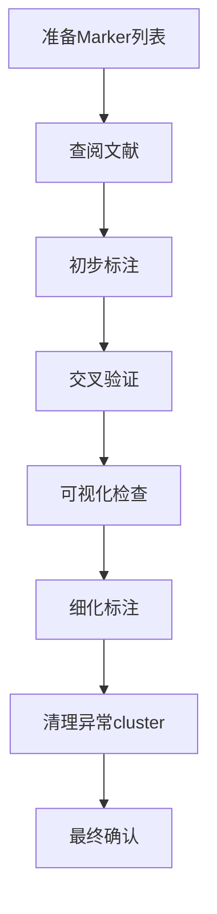

# 细胞类型手动标注完整指南

> **目标**：基于marker基因列表和生物学知识，为每个cluster赋予有意义的细胞类型名称

---

## 📋 目录

1. [标注流程概览](#标注流程概览)
2. [准备工作](#准备工作)
3. [标注策略](#标注策略)
4. [实战步骤](#实战步骤)
5. [常见DC亚型特征](#常见dc亚型特征)
6. [代码实现](#代码实现)
7. [质量控制](#质量控制)

---

## 标注流程概览

### 🎯 整体思路



### ⏱️ 预计时间

- **第一轮粗标注**：1-2小时
- **文献查阅验证**：2-3小时
- **精细化标注**：1-2小时
- **总计**：4-7小时（取决于cluster数量）

---

## 准备工作

### 📁 需要的文件

打开以下文件（都在 `downstream_results/integrated/` 目录）：

**1. Marker列表（Excel）**
```
Tables/
├── RNA_markers_for_RNA_clusters.xlsx     ← 基础
├── ADT_markers_for_ADT_clusters.xlsx     ← 基础
├── RNA_markers_for_ADT_clusters.xlsx     ← 跨模态（关键！）
└── ADT_markers_for_RNA_clusters.xlsx     ← 跨模态（关键！）
```

**2. 可视化图片**
```
Plots/
├── CrossModal/
│   └── crossmodal_quad_comparison.png    ← 空间关系
└── CellHighlight/
    ├── highlight_RNA_cluster_*.png       ← 每个cluster的位置
    └── highlight_ADT_cluster_*.png
```

**3. Seurat对象**
```
Robjects/
└── seurat_obj_for_annotation.rds         ← 用于后续标注
```

### 📚 准备文献资料

**必读综述**：
1. **cDC1 vs cDC2分化**
   - Guilliams et al., Nature Reviews Immunology (2014)
   - "Dendritic cells, monocytes and macrophages: a unified nomenclature"

2. **DC成熟与迁移**
   - Cabeza-Cabrerizo et al., Nature Reviews Immunology (2021)
   - "Dendritic cells revisited"

3. **脾脏DC亚群**
   - Edelson et al., Immunity (2010)
   - "Peripheral CD103+ dendritic cells form a unified subset..."

**在线资源**：
- **CellMarker数据库**: http://xteam.xbio.top/CellMarker/
- **PanglaoDB**: https://panglaodb.se/
- **scType**: https://github.com/IanevskiAleksandr/sc-type

---

## 标注策略

### 🎨 标注层次

**Level 1：大类标注**（粗分类）
```
示例：
- Dendritic cells
- T cells
- B cells
- Myeloid cells
```

**Level 2：亚型标注**（细分）
```
示例：
Dendritic cells 进一步分为：
- cDC1
- cDC2
- pDC
- Monocyte-derived DC
```

**Level 3：功能状态标注**（最细）
```
示例：
cDC1 进一步分为：
- Resident cDC1
- Migratory cDC1
- Proliferating cDC1
- Activated cDC1
```

### 🔍 判断依据优先级

**优先级 1：经典Marker基因** ✅
```
示例：
Xcr1, Clec9a 高表达 → 肯定是 cDC1
Sirpa, Cd24a 高表达 → 肯定是 cDC2
Cd3e, Cd3d 高表达 → 肯定是 T cells
```

**优先级 2：功能基因** ✅
```
示例：
Ccr7, Fscn1 高表达 → 迁移型DC
Mki67, Top2a 高表达 → 增殖细胞
Il12b, Il12a 高表达 → Th1极化DC
```

**优先级 3：空间位置** ⚠️
```
参考用：
- 紧密聚集 → 同质性高
- 与已知cluster相邻 → 可能有关联
- 孤立小群 → 可能是异常
```

**优先级 4：跨模态一致性** ⚠️
```
验证用：
- RNA和ADT一致 → 标注可靠
- 不一致 → 需要进一步探究
```

---

## 实战步骤

### 📊 第一步：打开Excel，逐个cluster分析

#### 示例：标注 RNA Cluster 0

**操作**：
1. 打开 `RNA_markers_for_RNA_clusters.xlsx`
2. 找到 "0" 这个Sheet
3. 查看 Top 10-20 markers

**实际数据示例**：
| gene | avg_log2FC | pct.1 | pct.2 | p_val_adj | score |
|------|------------|-------|-------|-----------|-------|
| Xcr1 | 3.2 | 0.95 | 0.12 | 1e-150 | 25.6 |
| Clec9a | 2.8 | 0.92 | 0.15 | 1e-120 | 17.2 |
| Itgae | 2.5 | 0.88 | 0.18 | 1e-100 | 12.2 |
| Cadm1 | 2.1 | 0.85 | 0.22 | 1e-80 | 7.9 |
| Id2 | 1.8 | 0.78 | 0.25 | 1e-60 | 5.6 |

**判断**：
```
✅ Xcr1 + Clec9a + Itgae = cDC1 的经典三联征
✅ pct.1 很高（90%+），pct.2 很低（15%-）
✅ 高度特异性

→ 初步判断：Cluster 0 = cDC1
```

#### 示例：标注 RNA Cluster 3

**实际数据示例**：
| gene | avg_log2FC | pct.1 | pct.2 | p_val_adj | score |
|------|------------|-------|-------|-----------|-------|
| Ccr7 | 4.5 | 0.98 | 0.08 | 1e-200 | 55.1 |
| Fscn1 | 3.8 | 0.95 | 0.10 | 1e-180 | 36.1 |
| Relb | 3.2 | 0.90 | 0.12 | 1e-150 | 24.0 |
| Cd40 | 2.9 | 0.88 | 0.15 | 1e-130 | 17.0 |
| Il12b | 2.5 | 0.82 | 0.18 | 1e-100 | 11.4 |

**判断**：
```
✅ Ccr7 = 淋巴结归巢受体（迁移标志）
✅ Fscn1 = 成熟DC的细胞骨架蛋白
✅ Relb = NF-κB家族，成熟标志
✅ Cd40 = 共刺激分子，活化标志
✅ Il12b = Th1极化能力

→ 判断：Cluster 3 = Migratory mature DC
   （更细致：Migratory cDC1 或 cDC2？需要看Xcr1/Sirpa）
```

#### 示例：标注 RNA Cluster 7

**实际数据示例**：
| gene | avg_log2FC | pct.1 | pct.2 | p_val_adj | score |
|------|------------|-------|-------|-----------|-------|
| Mki67 | 5.2 | 0.99 | 0.05 | 1e-250 | 103.0 |
| Top2a | 4.8 | 0.98 | 0.06 | 1e-230 | 80.7 |
| Pcna | 4.5 | 0.97 | 0.07 | 1e-210 | 67.6 |
| Ccnb1 | 4.2 | 0.95 | 0.08 | 1e-190 | 49.9 |
| Cdk1 | 3.9 | 0.93 | 0.10 | 1e-170 | 36.3 |

**判断**：
```
✅ Mki67 = 增殖标志（Ki-67抗原）
✅ Top2a = DNA拓扑异构酶，S/G2/M期
✅ Pcna = 增殖细胞核抗原
✅ Ccnb1, Cdk1 = 细胞周期蛋白

→ 判断：Cluster 7 = Proliferating cells
   （需要进一步确定：增殖的什么细胞？
    策略：查看 ADT markers，看蛋白表型）
```

### 🔬 第二步：交叉验证（跨模态）

#### 验证 Cluster 7（增殖细胞）的细胞类型

**操作**：
1. 打开 `ADT_markers_for_RNA_clusters.xlsx`
2. 找到 "7" 这个Sheet
3. 查看 Top ADT markers

**实际数据示例**：
| gene | avg_log2FC | pct.1 | pct.2 | p_val_adj | score |
|------|------------|-------|-------|-----------|-------|
| CD11c | 2.1 | 0.88 | 0.35 | 1e-50 | 5.3 |
| MHCII | 1.8 | 0.85 | 0.40 | 1e-40 | 3.8 |
| Xcr1 | 1.5 | 0.65 | 0.25 | 1e-30 | 2.6 |

**结论**：
```
✅ 蛋白水平：CD11c + MHCII + Xcr1 → DC表型，倾向cDC1
✅ RNA水平：Mki67 + Top2a → 增殖状态

→ 最终判断：Cluster 7 = Proliferating cDC1
```

### 🎨 第三步：查看空间位置

**操作**：
1. 打开 `crossmodal_quad_comparison.png`
2. 找到 Cluster 7 在 RNA UMAP 上的位置
3. 观察它与其他cluster的空间关系

**判断要点**：
```
如果 Cluster 7（增殖cDC1）：
✅ 与 Cluster 0（Resident cDC1）相邻
   → 合理：增殖是cDC1的一种状态

❌ 孤立在远处
   → 警惕：可能是doublets或质量问题

✅ 紧密聚集
   → 好：同质性高

❌ 高度分散
   → 警惕：可能包含多种细胞类型
```

### 📝 第四步：制作标注表格

创建一个Excel表格记录您的标注：

| RNA Cluster | Cell Count | Top Markers | Cell Type | Confidence | Notes |
|------------|-----------|-------------|-----------|-----------|-------|
| 0 | 2850 | Xcr1, Clec9a, Itgae | Resident cDC1 | High | 经典cDC1 markers |
| 1 | 2340 | Sirpa, Cd24a, Notch2 | Resident cDC2 | High | 经典cDC2 markers |
| 2 | 1890 | Cd209a, Clec4a4 | CD209a+ cDC2 | High | ESAM- cDC2亚群 |
| 3 | 1520 | Ccr7, Fscn1, Relb | Migratory DC | High | 需要细分cDC1/2 |
| 4 | 980 | Irf8, Batf3, Xcr1 | Activated cDC1 | Medium | 高表达转录因子 |
| 5 | 750 | Il12b, Tnf, Il1b | Inflammatory DC | Medium | 炎症表型 |
| 6 | 620 | Ccl17, Ccl22, Il4ra | Th2-polarizing cDC2 | Medium | Th2相关 |
| 7 | 450 | Mki67, Top2a, Pcna | Proliferating cDC1 | High | 增殖，ADT显示cDC1 |
| 8 | 320 | Cd3e, Cd3d, Cd8a | T cells | High | 混入的T细胞 |
| 9 | 180 | Nkg7, Gzma, Klrk1 | NK cells | High | 混入的NK细胞 |
| 10 | 120 | High mito% | Low quality | Low | **需要删除** |
| 11 | 85 | Hbb-bs, Hba-a1 | RBCs/Doublets | Low | **需要删除** |
| 12 | 65 | Mixed markers | Doublets | Low | **需要删除** |

---

## 常见DC亚型特征

### 🔵 cDC1亚型

#### 1. Resident cDC1（驻留型）
**Marker基因**：
- **经典三联征**：Xcr1, Clec9a, Itgae (CD103)
- **转录因子**：Irf8, Batf3, Id2
- **功能基因**：Tlr3, Clec12a, Cadm1

**特征**：
- 位于组织驻留位置
- 低表达迁移基因（Ccr7低）
- 低表达成熟标志（Cd86低）

#### 2. Migratory cDC1（迁移型）
**Marker基因**：
- **迁移标志**：Ccr7, Fscn1, Marcks
- **成熟标志**：Relb, Cd40, Cd86
- **cDC1特异**：Xcr1, Clec9a（保留）

**特征**：
- 高表达Ccr7（淋巴结归巢）
- 高表达共刺激分子
- 抗原提呈能力强

#### 3. Activated cDC1（活化型）
**Marker基因**：
- **炎症因子**：Il12b, Tnf, Il1b
- **共刺激**：Cd80, Cd86, Cd40
- **趋化因子**：Cxcl9, Cxcl10, Ccl5

**特征**：
- 响应病原体刺激
- Th1极化能力强
- 高表达I型干扰素基因

### 🟢 cDC2亚型

#### 1. Resident cDC2（驻留型）
**Marker基因**：
- **经典三联征**：Sirpa (CD172a), Cd24a, Notch2
- **转录因子**：Irf4, Klf4, Relb
- **表面标志**：H2-Ab1 (MHCII), Itgax (CD11c)

**特征**：
- 组织驻留
- 抗原监视功能
- Th2/Th17极化能力

#### 2. CD209a+ cDC2（ESAM-亚群）
**Marker基因**：
- **特异标志**：Cd209a, Clec4a4
- **低表达**：Esam（ESAM-）
- **cDC2特异**：Sirpa, Cd24a（保留）

**特征**：
- cDC2的一个亚群
- 功能可能与Th2相关

#### 3. Migratory cDC2（迁移型）
**Marker基因**：
- **迁移标志**：Ccr7, Fscn1
- **成熟标志**：Cd86, Cd40, Relb
- **cDC2特异**：Sirpa, Cd24a（保留）

#### 4. Th2-polarizing cDC2
**Marker基因**：
- **Th2相关**：Ccl17, Ccl22, Il4ra
- **共刺激**：Tnfrsf4 (OX40L), Cd274 (PD-L1)

### 🟡 特殊状态

#### 1. Proliferating DC（增殖型）
**Marker基因**：
- **增殖标志**：Mki67, Top2a, Pcna
- **细胞周期**：Ccnb1, Cdk1, Ccnd1
- **DNA合成**：Mcm3, Mcm5, Mcm6

**判断策略**：
```
步骤1：确认是增殖状态（Mki67+）
步骤2：查看ADT markers确定细胞类型
步骤3：标注为 "Proliferating [cell_type]"
```

#### 2. Inflammatory DC
**Marker基因**：
- **炎症因子**：Il1b, Tnf, Il6
- **趋化因子**：Ccl3, Ccl4, Cxcl2
- **激活标志**：Cd69, Cd83

### 🔴 需要删除的Cluster

#### 1. Low Quality Cells
**特征**：
- 高线粒体百分比（>20%）
- 低基因数（<500）
- 低UMI数（<1000）

#### 2. Doublets（双细胞）
**特征**：
- 表达两种细胞类型的marker
- 高基因数（>5000）
- 高UMI数（>20000）

**示例**：
```
同时高表达：
- cDC1 markers (Xcr1, Clec9a)
- T cell markers (Cd3e, Cd3d)
→ 可能是 cDC1-T cell doublets
```

#### 3. Non-target Cells（非目标细胞）
如果您只关注DC，需要删除：
- T cells (Cd3e+)
- B cells (Cd79a+, Ms4a1+)
- NK cells (Nkg7+, Ncr1+)
- RBCs (Hbb-bs+, Hba-a1+)

---

## 代码实现

### 方法1：手动创建标注向量

```r
library(Seurat)

# 1. 加载对象
seurat_obj <- readRDS("downstream_results/integrated/Robjects/seurat_obj_for_annotation.rds")

# 2. 查看cluster统计
table(seurat_obj$SCT_clusters)

# 3. 创建标注向量（根据上面的标注表格）
cluster_annotations <- c(
  "0" = "Resident cDC1",
  "1" = "Resident cDC2",
  "2" = "CD209a+ cDC2",
  "3" = "Migratory cDC",
  "4" = "Activated cDC1",
  "5" = "Inflammatory DC",
  "6" = "Th2-polarizing cDC2",
  "7" = "Proliferating cDC1",
  "8" = "T cells",
  "9" = "NK cells",
  "10" = "Low quality",
  "11" = "RBCs/Doublets",
  "12" = "Doublets"
)

# 4. 添加到meta.data
seurat_obj$cell_type <- cluster_annotations[as.character(seurat_obj$SCT_clusters)]

# 5. 可视化检查
DimPlot(seurat_obj, group.by = "cell_type", reduction = "umap",
        label = TRUE, repel = TRUE, label.size = 3) +
  labs(title = "Cell Type Annotation")

# 6. 保存
saveRDS(seurat_obj, "downstream_results/integrated/Robjects/seurat_obj_annotated.rds")
```

### 方法2：使用交互式CellSelector（推荐精细标注）

```r
library(Seurat)

# 1. 加载对象
seurat_obj <- readRDS("downstream_results/integrated/Robjects/seurat_obj_for_annotation.rds")

# 2. 绘制UMAP
p <- DimPlot(seurat_obj, reduction = "umap", group.by = "SCT_clusters",
             label = TRUE, label.size = 5)
print(p)

# 3. 交互式选择细胞（例如：精修Migratory DC的边界）
# 运行后会弹出窗口，用鼠标圈选细胞
seurat_obj <- CellSelector(plot = p, object = seurat_obj, ident = "Migratory cDC1")

# 4. 查看新的Idents
table(Idents(seurat_obj))

# 5. 保存到meta.data
seurat_obj$cell_type_refined <- Idents(seurat_obj)

# 6. 保存
saveRDS(seurat_obj, "downstream_results/integrated/Robjects/seurat_obj_annotated_refined.rds")
```

### 方法3：基于UMAP坐标清理异常细胞

```r
library(Seurat)
library(dplyr)

# 1. 加载对象
seurat_obj <- readRDS("downstream_results/integrated/Robjects/seurat_obj_annotated.rds")

# 2. 提取UMAP坐标
umap_coords <- as.data.frame(seurat_obj[["umap"]]@cell.embeddings)
colnames(umap_coords) <- c("UMAP_1", "UMAP_2")

# 3. 基于坐标删除异常区域
# 例如：删除UMAP_2 > 10的异常细胞
cells_to_remove <- rownames(umap_coords[umap_coords$UMAP_2 > 10, ])
cat("将删除", length(cells_to_remove), "个异常细胞\n")

# 4. 标记为异常
seurat_obj$cell_type[cells_to_remove] <- "Outlier_to_remove"

# 5. 可视化检查
DimPlot(seurat_obj, group.by = "cell_type", reduction = "umap",
        label = TRUE, repel = TRUE) +
  labs(title = "Cell Type with Outliers Marked")

# 6. 最终删除
seurat_obj_clean <- subset(seurat_obj, subset = cell_type != "Outlier_to_remove")

cat("清理后剩余", ncol(seurat_obj_clean), "个细胞\n")

# 7. 保存
saveRDS(seurat_obj_clean, "downstream_results/integrated/Robjects/seurat_obj_final_clean.rds")
```

### 方法4：删除非目标细胞类型

```r
# 假设您只关注DC，删除T cells、NK cells等

# 1. 定义要保留的细胞类型
dc_types <- c(
  "Resident cDC1",
  "Resident cDC2",
  "CD209a+ cDC2",
  "Migratory cDC",
  "Activated cDC1",
  "Inflammatory DC",
  "Th2-polarizing cDC2",
  "Proliferating cDC1"
)

# 2. 子集化
seurat_obj_dc_only <- subset(seurat_obj, subset = cell_type %in% dc_types)

cat("保留", ncol(seurat_obj_dc_only), "个DC细胞\n")

# 3. 重新聚类（可选，基于清理后的细胞）
seurat_obj_dc_only <- FindNeighbors(seurat_obj_dc_only, dims = 1:25)
seurat_obj_dc_only <- FindClusters(seurat_obj_dc_only, resolution = 0.5)

# 4. 保存
saveRDS(seurat_obj_dc_only, "downstream_results/integrated/Robjects/seurat_obj_DC_only.rds")
```

---

## 质量控制

### ✅ 标注质量检查清单

**1. 生物学合理性**
- [ ] 每个cluster的marker基因功能相关
- [ ] 细胞类型符合文献报道
- [ ] 稀有群体有充分证据

**2. 空间一致性**
- [ ] 相同类型的cluster在UMAP上相邻
- [ ] 不同类型的cluster空间分离
- [ ] 没有高度分散的cluster

**3. 跨模态一致性**
- [ ] RNA和ADT markers功能匹配
- [ ] 蛋白表型支持RNA标注
- [ ] 解偶联现象有合理解释

**4. 统计质量**
- [ ] 每个cluster细胞数>50（小cluster需要谨慎）
- [ ] Marker基因的p_val_adj < 0.05
- [ ] pct.1 > 0.5, pct.1/pct.2 > 2

### 📊 生成验证图

```r
library(Seurat)
library(ggplot2)
library(patchwork)

# 1. 加载标注后的对象
seurat_obj <- readRDS("downstream_results/integrated/Robjects/seurat_obj_annotated.rds")

# 2. 对比标注前后
p1 <- DimPlot(seurat_obj, group.by = "SCT_clusters", reduction = "umap",
              label = TRUE) +
  labs(title = "Original Clusters")

p2 <- DimPlot(seurat_obj, group.by = "cell_type", reduction = "umap",
              label = TRUE, repel = TRUE) +
  labs(title = "Annotated Cell Types")

p_compare <- p1 | p2
ggsave("downstream_results/integrated/Plots/annotation_comparison.png",
       p_compare, width = 20, height = 8, dpi = 300)

# 3. 细胞类型统计
cell_type_stats <- as.data.frame(table(seurat_obj$cell_type))
colnames(cell_type_stats) <- c("Cell_Type", "Count")
cell_type_stats$Percentage <- round(cell_type_stats$Count / sum(cell_type_stats$Count) * 100, 2)

print(cell_type_stats)

# 4. Marker基因热图验证
key_markers <- c(
  # cDC1
  "Xcr1", "Clec9a", "Itgae",
  # cDC2
  "Sirpa", "Cd24a", "Notch2",
  # Migratory
  "Ccr7", "Fscn1", "Relb",
  # Activated
  "Il12b", "Tnf", "Cd40",
  # Proliferating
  "Mki67", "Top2a"
)

DoHeatmap(seurat_obj, features = key_markers, group.by = "cell_type",
          size = 3) +
  scale_fill_gradientn(colors = c("blue", "white", "red"))

ggsave("downstream_results/integrated/Plots/annotation_validation_heatmap.png",
       width = 14, height = 10, dpi = 300)
```

---

## 常见问题

### ❓ Q1：某个cluster的marker基因不明显怎么办？

**A**：可能原因和解决方法：
1. **分辨率太高**：cluster太细，降低resolution重新聚类
2. **过渡状态**：可能是两种状态之间，查看轨迹分析
3. **技术假象**：检查QC指标，可能需要删除
4. **新亚群**：查阅最新文献，可能是新发现

### ❓ Q2：RNA和ADT标注不一致怎么办？

**A**：分析策略：
1. 优先相信**经典marker**（如Xcr1, Clec9a）
2. 查看**空间位置**：与哪个cluster相邻
3. 查阅**文献**：是否有报道的解偶联现象
4. **保守标注**：不确定的标注为"Unknown"或"Ambiguous"

### ❓ Q3：如何决定删除哪些cluster？

**A**：删除标准：
1. **质量差**：高mito%、低UMI、低genes
2. **明显doublets**：混合marker、高UMI
3. **非常小**：<50细胞且没有特异marker
4. **空间异常**：高度分散或孤立

### ❓ Q4：标注的置信度如何评估？

**A**：置信度等级：
- **High**：3个以上经典marker + 文献支持 + 空间合理
- **Medium**：2个marker + 功能一致 + 需要验证
- **Low**：1个marker 或 与文献不符 或 空间异常

---

## 下一步

完成标注后：

1. **生成最终UMAP图**（类似文献Figure 1）
2. **导出细胞类型比例表**
3. **进行差异表达分析**（按细胞类型）
4. **功能富集分析**（GSEA, GO, KEGG）
5. **轨迹分析**（如cDC成熟轨迹）
6. **细胞通讯分析**（CellChat, CellPhoneDB）

---

## 参考文献

1. Guilliams et al. (2014) Nature Reviews Immunology - DC命名规范
2. Cabeza-Cabrerizo et al. (2021) Nature Reviews Immunology - DC综述
3. Edelson et al. (2010) Immunity - 脾脏DC亚群
4. Anderson et al. (2021) Cell - CITE-seq方法学
5. 您的原文献 - 脾脏cDC稳态成熟

---

**🎉 祝标注顺利！有问题随时提问。**
